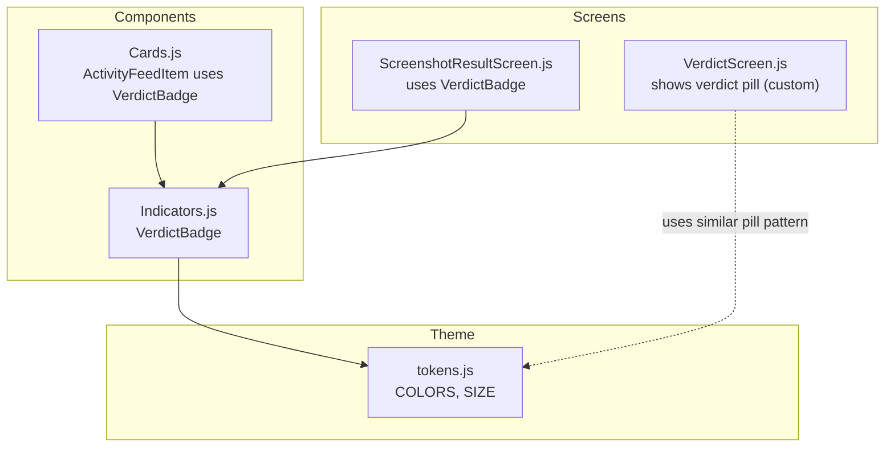
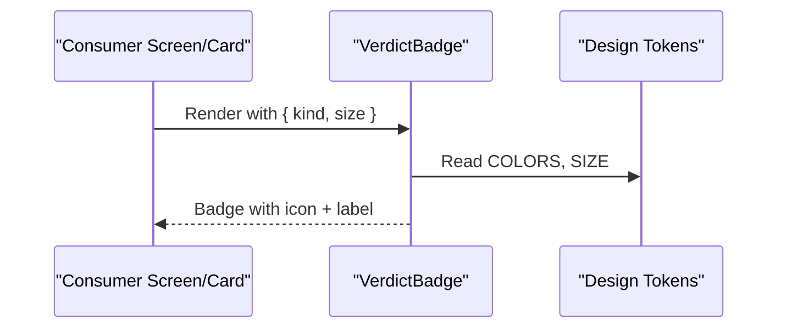
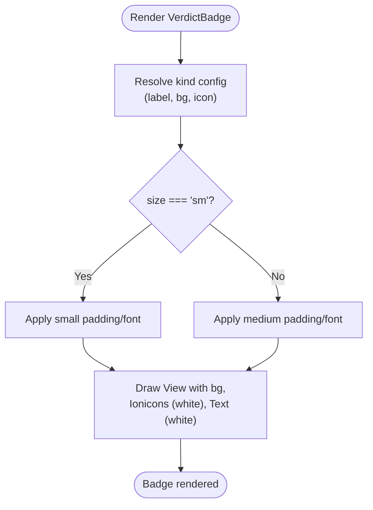
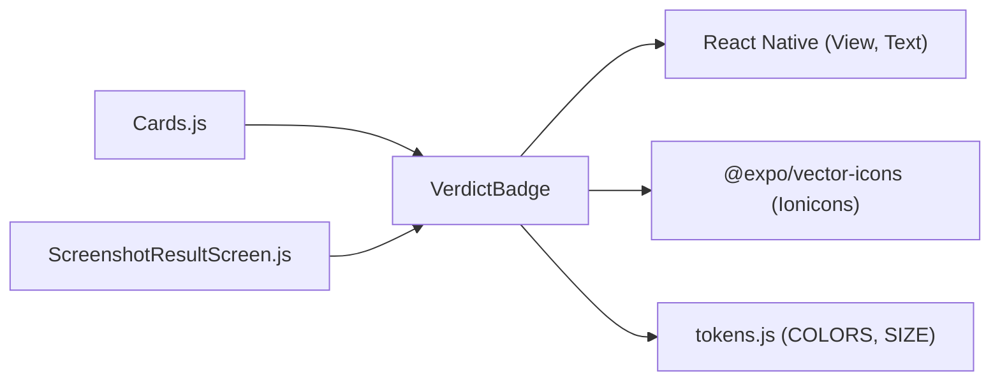

# VerdictBadge Component

<cite>
**Referenced Files in This Document**
- [Indicators.js](file://src/components/Indicators.js)
- [Cards.js](file://src/components/Cards.js)
- [ScreenshotResultScreen.js](file://src/screens/ScreenshotResultScreen.js)
- [VerdictScreen.js](file://src/screens/VerdictScreen.js)
- [tokens.js](file://src/theme/tokens.js)
</cite>

## Table of Contents
1. Introduction
2. Project Structure
3. Core Components
4. Architecture Overview
5. Detailed Component Analysis
6. Dependency Analysis
7. Performance Considerations
8. Troubleshooting Guide
9. Conclusion
10. Appendices

## Introduction
This document provides comprehensive documentation for the VerdictBadge component, a small inline indicator that displays verdict status pills with an icon and label. It supports three verdict types: scam (danger), safe (accent), and suspicious (warning). The component is used across screens to quickly communicate risk levels and outcomes of scans or analyses.

## Project Structure
The VerdictBadge lives within the components layer and is consumed by multiple screens and cards. Its visual tokens are centralized in the theme module.

**Diagram sources**
- [Indicators.js:10-27](file://src/components/Indicators.js#L10-L27)
- [Cards.js:88-110](file://src/components/Cards.js#L88-L110)
- [ScreenshotResultScreen.js:1-152](file://src/screens/ScreenshotResultScreen.js#L1-L152)
- [VerdictScreen.js:1-268](file://src/screens/VerdictScreen.js#L1-L268)
- [tokens.js:7-44](file://src/theme/tokens.js#L7-L44)

**Section sources**
- [Indicators.js:10-27](file://src/components/Indicators.js#L10-L27)
- [Cards.js:88-110](file://src/components/Cards.js#L88-L110)
- [ScreenshotResultScreen.js:1-152](file://src/screens/ScreenshotResultScreen.js#L1-L152)
- [VerdictScreen.js:1-268](file://src/screens/VerdictScreen.js#L1-L268)
- [tokens.js:7-44](file://src/theme/tokens.js#L7-L44)

## Core Components
- VerdictBadge: Renders a compact badge with background color, white icon, and white label text. Supports two sizes via a size prop.
- ActivityFeedItem: Demonstrates using VerdictBadge in a list item context with a small size variant.
- Screens: ScreenshotResultScreen and VerdictScreen show how verdicts are presented to users; VerdictScreen uses a custom pill but follows the same semantic meaning as VerdictBadge.

Key props:
- kind: 'scam' | 'safe' | 'susp'
- size: 'md' | 'sm'

Visual mapping:
- scam: danger background, warning icon, label "SCAM"
- safe: accentDk background, checkmark-circle icon, label "SAFE"
- susp: warning background, alert-circle icon, label "SUSPICIOUS"

Sizes:
- md (default): larger padding and font
- sm: smaller padding and font for tight layouts

**Section sources**
- [Indicators.js:10-27](file://src/components/Indicators.js#L10-L27)
- [Cards.js:88-110](file://src/components/Cards.js#L88-L110)
- [ScreenshotResultScreen.js:54-56](file://src/screens/ScreenshotResultScreen.js#L54-L56)
- [tokens.js:7-44](file://src/theme/tokens.js#L7-L44)

## Architecture Overview
VerdictBadge is a presentational component that depends on design tokens for colors and typography. It does not manage state or side effects, making it highly reusable and predictable.

**Diagram sources**
- [Indicators.js:10-27](file://src/components/Indicators.js#L10-L27)
- [tokens.js:7-44](file://src/theme/tokens.js#L7-L44)

## Detailed Component Analysis

### VerdictBadge Implementation
- Props:
  - kind: Determines background color, icon name, and label text.
  - size: Controls padding and font size.
- Behavior:
  - Maps kind to a configuration object containing label, background color, and Ionicons name.
  - Applies size-based padding and font size.
  - Uses white icon and white label text for contrast against colored backgrounds.

**Diagram sources**
- [Indicators.js:10-27](file://src/components/Indicators.js#L10-L27)

**Section sources**
- [Indicators.js:10-27](file://src/components/Indicators.js#L10-L27)

### Usage Examples

- Scam warning:
  - Use kind="scam" to display a red-tinted badge with a warning icon and "SCAM" label.
  - Example usage path: [ScreenshotResultScreen.js:54-56](file://src/screens/ScreenshotResultScreen.js#L54-L56)

- Safe confirmation:
  - Use kind="safe" to display a green-tinted badge with a checkmark icon and "SAFE" label.
  - Example usage path: [Cards.js:94-106](file://src/components/Cards.js#L94-L106)

- Suspicious alert:
  - Use kind="susp" to display an amber-tinted badge with an alert icon and "SUSPICIOUS" label.
  - Example usage path: [Cards.js:94-106](file://src/components/Cards.js#L94-L106)

- Small variant:
  - Use size="sm" for compact contexts like activity feed items.
  - Example usage path: [Cards.js:104-106](file://src/components/Cards.js#L104-L106)

**Section sources**
- [ScreenshotResultScreen.js:54-56](file://src/screens/ScreenshotResultScreen.js#L54-L56)
- [Cards.js:94-106](file://src/components/Cards.js#L94-L106)

### Visual Appearance
- Background colors:
  - scam: danger
  - safe: accentDk
  - susp: warning
- Text and icons:
  - White icon and white label text for readability on colored backgrounds.
- Sizes:
  - md: default padding and font size
  - sm: reduced padding and font size

These values are sourced from the design tokens.

**Section sources**
- [Indicators.js:10-27](file://src/components/Indicators.js#L10-L27)
- [tokens.js:7-44](file://src/theme/tokens.js#L7-L44)

### Accessibility Considerations
- Contrast: White text and icons on colored backgrounds provide strong contrast for readability.
- Semantics: Ensure surrounding content clearly communicates the meaning of each badge (e.g., pairing with descriptive text).
- Screen readers: If needed, add accessibility labels to badges to describe the verdict type (e.g., “Scam”, “Safe”, “Suspicious”).
- Color blindness: Do not rely solely on color; combine color with icons and labels, which this component already does.

[No sources needed since this section provides general guidance]

### Integration Patterns
- Within verdict screens:
  - VerdictScreen shows a high-level verdict pill in its header area. While it uses a custom pill, the semantics align with VerdictBadge’s purpose.
  - Reference: [VerdictScreen.js:53-59](file://src/screens/VerdictScreen.js#L53-L59)
- Within analysis results:
  - ScreenshotResultScreen uses VerdictBadge to indicate a scam result alongside supporting details.
  - Reference: [ScreenshotResultScreen.js:54-56](file://src/screens/ScreenshotResultScreen.js#L54-L56)
- Within lists and feeds:
  - ActivityFeedItem renders VerdictBadge with size="sm" to fit compact rows.
  - Reference: [Cards.js:94-106](file://src/components/Cards.js#L94-L106)

**Section sources**
- [VerdictScreen.js:53-59](file://src/screens/VerdictScreen.js#L53-L59)
- [ScreenshotResultScreen.js:54-56](file://src/screens/ScreenshotResultScreen.js#L54-L56)
- [Cards.js:94-106](file://src/components/Cards.js#L94-L106)

## Dependency Analysis
VerdictBadge has minimal dependencies:
- React Native primitives: View, Text
- Ionicons for icons
- Design tokens for colors and typography

Consumers depend on VerdictBadge for consistent verdict signaling.

**Diagram sources**
- [Indicators.js:10-27](file://src/components/Indicators.js#L10-L27)
- [Cards.js:88-110](file://src/components/Cards.js#L88-L110)
- [ScreenshotResultScreen.js:1-152](file://src/screens/ScreenshotResultScreen.js#L1-L152)
- [tokens.js:7-44](file://src/theme/tokens.js#L7-L44)

**Section sources**
- [Indicators.js:10-27](file://src/components/Indicators.js#L10-L27)
- [Cards.js:88-110](file://src/components/Cards.js#L88-L110)
- [ScreenshotResultScreen.js:1-152](file://src/screens/ScreenshotResultScreen.js#L1-L152)
- [tokens.js:7-44](file://src/theme/tokens.js#L7-L44)

## Performance Considerations
- Lightweight: VerdictBadge is a pure presentational component with no state or side effects.
- Reuse: Centralized token usage ensures consistent rendering and avoids redundant style computations.
- Layout: Small size variant reduces layout cost in dense lists.

[No sources needed since this section provides general guidance]

## Troubleshooting Guide
- Wrong kind value:
  - Ensure kind is one of 'scam', 'safe', 'susp'. Unknown values will fall back to default behavior defined in the component.
- Incorrect size:
  - Use 'md' or 'sm'. Other values may render unexpectedly due to conditional styling.
- Icon mismatch:
  - Verify that the chosen kind maps to the intended icon and label.
- Contrast issues:
  - Confirm that the background color from tokens provides sufficient contrast with white text/icons.

**Section sources**
- [Indicators.js:10-27](file://src/components/Indicators.js#L10-L27)

## Conclusion
VerdictBadge is a simple, reliable component for displaying verdict status pills with clear visual cues. It integrates seamlessly into screens and lists, supports multiple sizes, and adheres to the app’s design tokens for consistency and accessibility.

[No sources needed since this section summarizes without analyzing specific files]

## Appendices

### Prop Reference
- kind: 'scam' | 'safe' | 'susp'
  - scam: danger background, warning icon, "SCAM" label
  - safe: accentDk background, checkmark-circle icon, "SAFE" label
  - susp: warning background, alert-circle icon, "SUSPICIOUS" label
- size: 'md' | 'sm'
  - md: default padding and font size
  - sm: smaller padding and font size

**Section sources**
- [Indicators.js:10-27](file://src/components/Indicators.js#L10-L27)

### Token Reference
- Colors:
  - danger, accentDk, warning
- Typography:
  - SIZE.xs for medium label font size
- Radii and spacing:
  - RADIUS.chip for rounded chips elsewhere in the app

**Section sources**
- [tokens.js:7-44](file://src/theme/tokens.js#L7-L44)