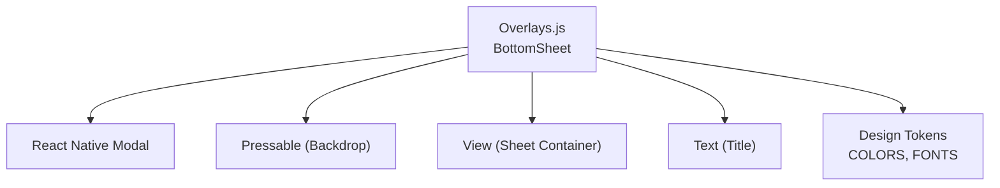
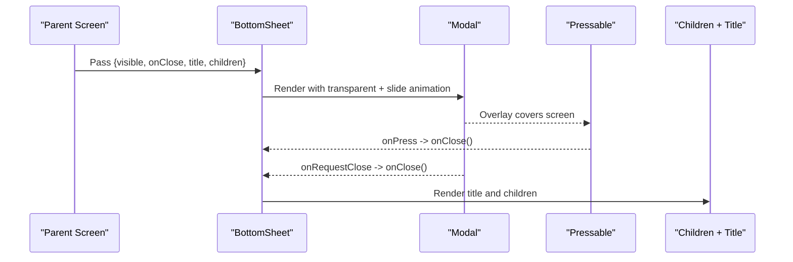
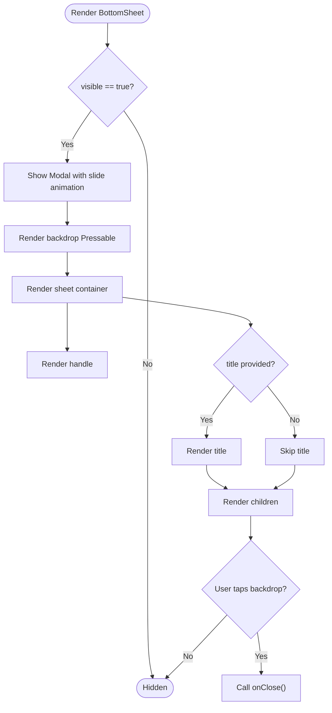
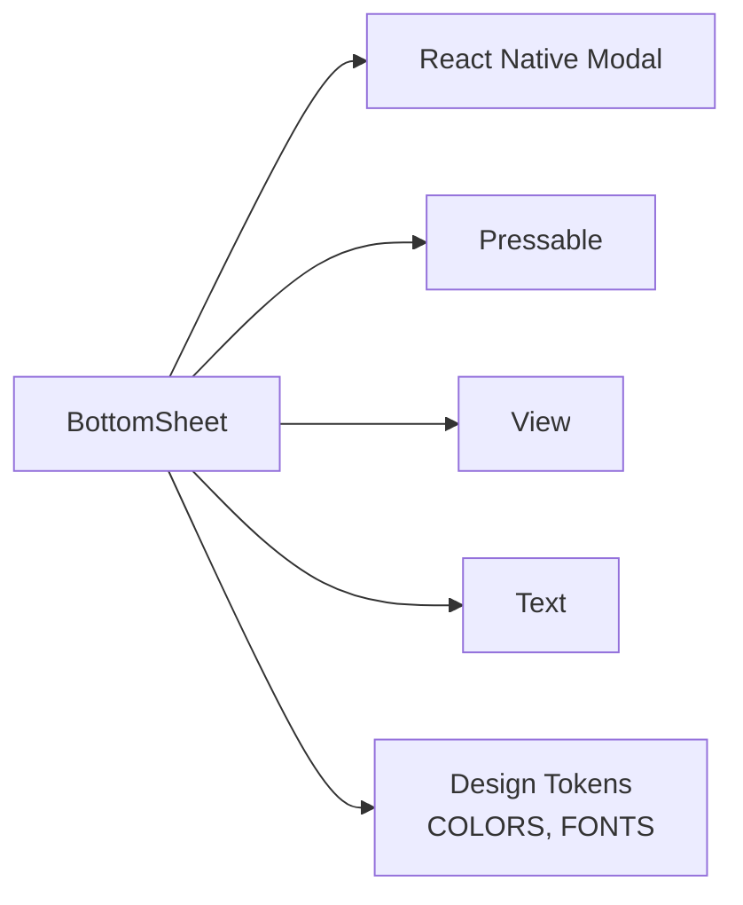

# BottomSheet Component

<cite>
**Referenced Files in This Document**
- [Overlays.js](file://src/components/Overlays.js)
- [tokens.js](file://src/theme/tokens.js)
- [README.md](file://README.md)
</cite>

## Table of Contents
1. [Introduction](#introduction)
2. [Project Structure](#project-structure)
3. [Core Components](#core-components)
4. [Architecture Overview](#architecture-overview)
5. [Detailed Component Analysis](#detailed-component-analysis)
6. [Dependency Analysis](#dependency-analysis)
7. [Performance Considerations](#performance-considerations)
8. [Troubleshooting Guide](#troubleshooting-guide)
9. [Conclusion](#conclusion)
10. [Appendices](#appendices)

## Introduction
This document provides detailed documentation for the BottomSheet component, a modal overlay used to present action menus and additional information panels at the bottom of the screen. It explains how the sheet is implemented using React Native’s Modal with slide animation, backdrop handling via Pressable, and a visual handle for user interaction. The component exposes props for visibility control, closing behavior, content rendering, and an optional title. Styling is grounded in the project’s design tokens for consistent appearance across the app.

## Project Structure
The BottomSheet component lives within the overlays module alongside other overlay-related UI elements. It relies on core React Native primitives and the shared design tokens for colors and typography.

**Diagram sources**
- [Overlays.js:82-94](file://src/components/Overlays.js#L82-L94)
- [tokens.js:7-68](file://src/theme/tokens.js#L7-L68)

**Section sources**
- [Overlays.js:1-123](file://src/components/Overlays.js#L1-L123)
- [tokens.js:1-129](file://src/theme/tokens.js#L1-L129)

## Core Components
- BottomSheet: A modal-based bottom sheet that slides into view, displays a handle, optional title, and children content. It closes when the backdrop is pressed or when the platform requests close via onRequestClose.

Key behaviors:
- Slide animation: Uses Modal’s built-in slide animation.
- Backdrop: Semi-transparent overlay that dismisses the sheet when tapped.
- Handle: Visual indicator at the top of the sheet.
- Title: Optional header text rendered above the children.
- Children: Any content can be passed as children to render inside the sheet.

Props:
- visible: Boolean controlling whether the sheet is shown.
- onClose: Function called when the sheet should close (backdrop press or system close request).
- children: Content to display inside the sheet.
- title: Optional string to show as the sheet title.

Styling highlights:
- Sheet background and rounded top corners.
- Handle styling for affordance.
- Title typography from design tokens.
- Backdrop color from design tokens.

Accessibility notes:
- The component uses Modal which manages focus and accessibility context on most platforms. Ensure your children include accessible labels where appropriate (e.g., buttons, inputs).
- Provide meaningful titles and labels for interactive elements inside the sheet to support screen readers.

Usage reference:
- The README documents the BottomSheet API surface for quick adoption.

**Section sources**
- [Overlays.js:82-94](file://src/components/Overlays.js#L82-L94)
- [Overlays.js:96-122](file://src/components/Overlays.js#L96-L122)
- [README.md:221-222](file://README.md#L221-L222)

## Architecture Overview
The BottomSheet composes React Native primitives to create a modal overlay pattern:

**Diagram sources**
- [Overlays.js:82-94](file://src/components/Overlays.js#L82-L94)

## Detailed Component Analysis

### BottomSheet Implementation
- Modal: Transparent overlay with slide animation; handles visibility and platform close requests.
- Backdrop: Full-screen Pressable that calls onClose when tapped.
- Sheet container: Positioned at the bottom with rounded top corners and padding.
- Handle: Centered pill-shaped bar indicating draggable affordance.
- Title: Optional header styled with design tokens.
- Children: Flexible content area for actions or information.

**Diagram sources**
- [Overlays.js:82-94](file://src/components/Overlays.js#L82-L94)
- [Overlays.js:96-122](file://src/components/Overlays.js#L96-L122)

**Section sources**
- [Overlays.js:82-94](file://src/components/Overlays.js#L82-L94)
- [Overlays.js:96-122](file://src/components/Overlays.js#L96-L122)

### Props Reference
- visible: Controls modal visibility.
- onClose: Callback invoked by backdrop press and platform close request.
- children: Any React nodes to render inside the sheet.
- title: Optional string displayed as the sheet header.

**Section sources**
- [Overlays.js:82-94](file://src/components/Overlays.js#L82-L94)

### Styling Options
- Backdrop: Semi-transparent overlay color from design tokens.
- Sheet: White background with rounded top corners and vertical/horizontal padding.
- Handle: Pill-shaped bar centered at the top of the sheet.
- Title: Typography and color from design tokens.

These styles are defined locally in the component’s StyleSheet and rely on shared tokens for consistency.

**Section sources**
- [Overlays.js:96-122](file://src/components/Overlays.js#L96-L122)
- [tokens.js:7-68](file://src/theme/tokens.js#L7-L68)

### Accessibility Features
- Modal manages focus and presentation semantics.
- Use accessible labels for interactive elements inside the sheet.
- Provide clear titles and descriptive text for better screen reader experience.

[No sources needed since this section provides general guidance]

### Touch Interaction Patterns
- Backdrop tap closes the sheet via onPress handler bound to onClose.
- Platform-specific close gestures (e.g., swipe back) trigger onRequestClose, which also calls onClose.

**Section sources**
- [Overlays.js:82-94](file://src/components/Overlays.js#L82-L94)

### Keyboard Navigation
- Modal typically captures focus when opened. Ensure focus management within children if you add inputs or complex controls.
- On Android, hardware back button triggers onRequestClose; ensure onClose updates state to hide the sheet.

[No sources needed since this section provides general guidance]

### State Management Guidelines
- Manage visibility in parent component state (e.g., useState).
- Update state in onClose to set visible to false.
- Avoid nested modals unless necessary; keep the sheet focused on one task.

[No sources needed since this section provides general guidance]

### Examples

#### Confirmation Dialog
- Use title to describe the confirmation.
- Place two action buttons in children: Confirm and Cancel.
- Bind Confirm to perform action then call onClose; bind Cancel to just call onClose.

[No sources needed since this section provides general guidance]

#### Action Menu
- Use title to label the menu context.
- List menu items in children as Pressable rows with icons and labels.
- Each item calls its respective action then onClose.

[No sources needed since this section provides general guidance]

#### Informational Overlay
- Use title to summarize the info panel.
- Add descriptive text, images, or lists in children.
- Include a “Dismiss” button that calls onClose.

[No sources needed since this section provides general guidance]

### Content Layout Guidelines
- Keep content concise and scannable.
- Use spacing and alignment consistent with design tokens.
- For long content, consider ScrollView inside children to enable scrolling within the sheet.

[No sources needed since this section provides general guidance]

### Responsive Design Considerations
- The sheet spans full width and anchors to the bottom; ensure critical actions are within easy reach.
- Test on various screen sizes; avoid overly tall content that may obscure important parts of the underlying screen.

[No sources needed since this section provides general guidance]

## Dependency Analysis
The BottomSheet depends on:
- React Native Modal for presentation and animation.
- Pressable for backdrop interaction.
- View and Text for layout and title rendering.
- Design tokens for colors and fonts.

**Diagram sources**
- [Overlays.js:5-14](file://src/components/Overlays.js#L5-L14)
- [Overlays.js:82-94](file://src/components/Overlays.js#L82-L94)
- [tokens.js:7-68](file://src/theme/tokens.js#L7-L68)

**Section sources**
- [Overlays.js:5-14](file://src/components/Overlays.js#L5-L14)
- [Overlays.js:82-94](file://src/components/Overlays.js#L82-L94)
- [tokens.js:7-68](file://src/theme/tokens.js#L7-L68)

## Performance Considerations
- Modal re-renders when visible changes; minimize unnecessary re-renders by lifting state appropriately.
- Keep children lightweight; defer heavy computations until the sheet opens.
- Avoid excessive animations inside the sheet to maintain smooth interactions.

[No sources needed since this section provides general guidance]

## Troubleshooting Guide
- Sheet does not close on backdrop tap: Verify onPress is bound to onClose and that visible state updates correctly.
- Platform back button does not close: Ensure onRequestClose is wired to onClose and updates visibility.
- Content overflow: Wrap children in ScrollView if content exceeds available height.
- Focus issues: If adding inputs, ensure they receive focus properly and keyboard avoids overlapping the sheet.

[No sources needed since this section provides general guidance]

## Conclusion
The BottomSheet component offers a simple, token-driven modal pattern for presenting action menus and informational panels. It leverages React Native’s Modal for slide animation and backdrop handling, while providing a clean interface through props for visibility, closing behavior, content, and an optional title. Follow the guidelines for state management, accessibility, and responsive layout to deliver a consistent and user-friendly experience.

## Appendices

### Quick Usage Reference
- Import BottomSheet from the overlays module.
- Control visibility with parent state and pass onClose to update it.
- Add a title and children to define the sheet’s purpose and actions.

**Section sources**
- [README.md:221-222](file://README.md#L221-L222)