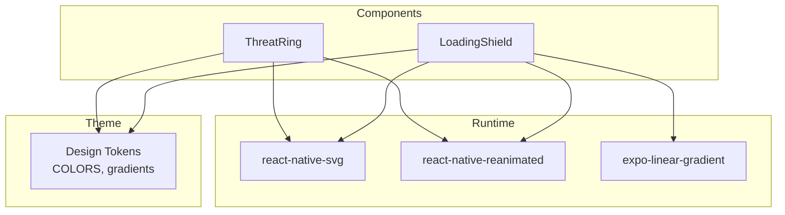
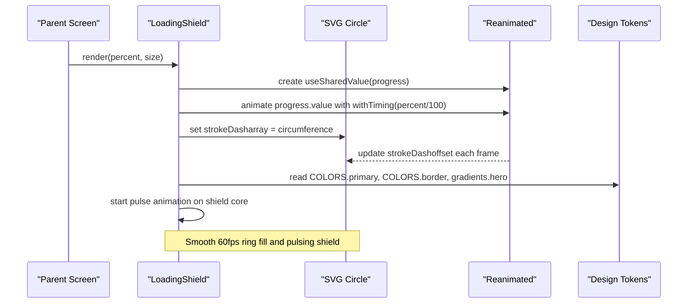
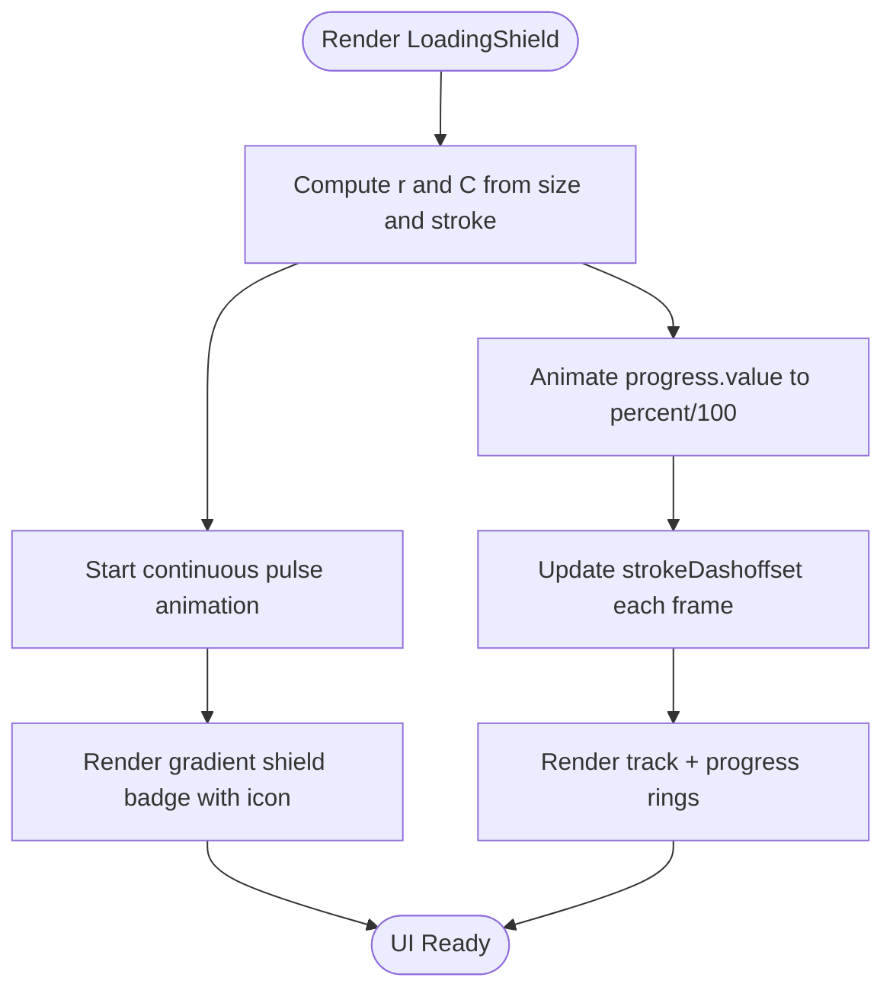
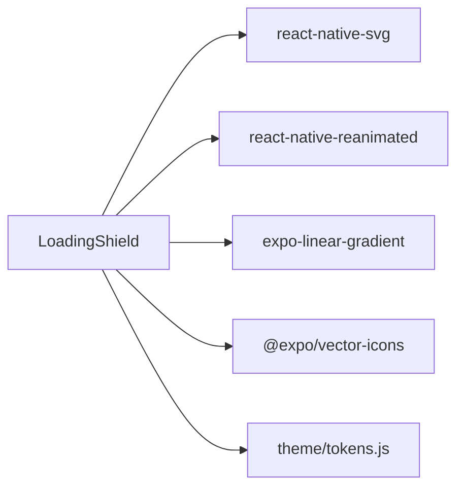

# LoadingShield Component

<cite>
**Referenced Files in This Document**
- [Overlays.js](file://src/components/Overlays.js)
- [tokens.js](file://src/theme/tokens.js)
- [package.json](file://package.json)
</cite>

## Table of Contents
1. [Introduction](#introduction)
2. [Project Structure](#project-structure)
3. [Core Components](#core-components)
4. [Architecture Overview](#architecture-overview)
5. [Detailed Component Analysis](#detailed-component-analysis)
6. [Dependency Analysis](#dependency-analysis)
7. [Performance Considerations](#performance-considerations)
8. [Troubleshooting Guide](#troubleshooting-guide)
9. [Conclusion](#conclusion)
10. [Appendices](#appendices)

## Introduction
LoadingShield is an animated progress indicator used during analysis operations to visually communicate ongoing work and completion status. It combines:
- A circular SVG progress ring that animates based on a percentage value
- A pulsing shield icon centered inside the ring
- A radial glow behind the component for visual emphasis
- A gradient-filled shield badge with an integrated shield-checkmark icon

The component uses react-native-reanimated for smooth, GPU-accelerated animations and react-native-svg for precise circle stroke animations.

## Project Structure
LoadingShield lives within the shared components layer and consumes design tokens from the theme module. It integrates with the app’s navigation flow by being shown while analysis runs and hidden when results are ready.

**Diagram sources**
- [Overlays.js:1-123](file://src/components/Overlays.js#L1-L123)
- [tokens.js:1-129](file://src/theme/tokens.js#L1-L129)

**Section sources**
- [Overlays.js:1-123](file://src/components/Overlays.js#L1-L123)
- [tokens.js:1-129](file://src/theme/tokens.js#L1-L129)
- [package.json:11-33](file://package.json#L11-L33)

## Core Components
- LoadingShield: Animated shield + circular progress ring with pulsing effect and gradient background.
- Supporting elements: Radial glow, SVG circles for track and progress, gradient shield badge, and Ionicons shield-checkmark.

Key behaviors:
- Progress ring animates via strokeDashoffset using Reanimated shared values.
- Shield core pulses continuously using a repeating sequence animation.
- Colors and gradients come from centralized design tokens to ensure consistency.

**Section sources**
- [Overlays.js:18-80](file://src/components/Overlays.js#L18-L80)
- [tokens.js:7-54](file://src/theme/tokens.js#L7-L54)

## Architecture Overview
LoadingShield composes multiple layers:
- Background glow (radial gradient)
- Track circle (static background ring)
- Progress circle (animated strokeDashoffset)
- Centered shield badge (gradient + icon) with pulse animation

**Diagram sources**
- [Overlays.js:20-40](file://src/components/Overlays.js#L20-L40)
- [Overlays.js:57-77](file://src/components/Overlays.js#L57-L77)
- [tokens.js:7-54](file://src/theme/tokens.js#L7-L54)

## Detailed Component Analysis

### Props
- percent: Number representing progress from 0 to 100. Drives the ring fill.
- size: Number controlling overall dimensions of the component.

Default values:
- percent defaults to 60
- size defaults to 120

Usage examples:
- Show loading during API calls: pass percent incrementally or keep it at a fixed value while waiting.
- Customize appearance: adjust size for different contexts; colors and gradients are derived from theme tokens.

**Section sources**
- [Overlays.js:19-24](file://src/components/Overlays.js#L19-L24)

### Animation Timing and Easing
- Progress animation:
  - Duration: 800ms
  - Uses withTiming to smoothly transition to target progress
- Pulse animation:
  - Continuous repeat (-1)
  - Sequence: scale up to 1.04 then back to 1.0
  - Each step duration: 1500ms
  - Easing: ease-in-out for natural feel

These timings provide a responsive yet calm user experience during analysis.

**Section sources**
- [Overlays.js:26-35](file://src/components/Overlays.js#L26-L35)

### SVG Circle Stroke Animations
- The component computes radius r from size and stroke width, then calculates circumference C = 2πr.
- The progress circle uses strokeDasharray set to C and animates strokeDashoffset to C - progress * C.
- Rotation transform rotates the circle by -90 degrees so progress starts at the top.

This technique ensures accurate percentage-based ring filling independent of size changes.

**Section sources**
- [Overlays.js:20-23](file://src/components/Overlays.js#L20-L23)
- [Overlays.js:37-39](file://src/components/Overlays.js#L37-L39)
- [Overlays.js:57-65](file://src/components/Overlays.js#L57-L65)

### Pulsing Effect and Gradient Background
- Pulsing:
  - A separate shared value drives scale transforms on the shield core container
  - Repeated sequence creates a gentle breathing effect
- Gradient background:
  - Radial gradient glow behind the component using react-native-svg Defs/RadialGradient
  - Shield badge uses LinearGradient from theme tokens for consistent brand styling

**Section sources**
- [Overlays.js:28-34](file://src/components/Overlays.js#L28-L34)
- [Overlays.js:44-55](file://src/components/Overlays.js#L44-L55)
- [Overlays.js:68-77](file://src/components/Overlays.js#L68-L77)
- [tokens.js:46-54](file://src/theme/tokens.js#L46-L54)

### Shield Icon Integration
- The center shield badge displays an Ionicons shield-checkmark icon
- Badge background uses a linear gradient from theme tokens
- Shadow and elevation enhance depth and focus

**Section sources**
- [Overlays.js:68-77](file://src/components/Overlays.js#L68-L77)
- [tokens.js:46-54](file://src/theme/tokens.js#L46-L54)

### Implementation Patterns and Data Flow

**Diagram sources**
- [Overlays.js:20-40](file://src/components/Overlays.js#L20-L40)
- [Overlays.js:57-77](file://src/components/Overlays.js#L57-L77)

**Section sources**
- [Overlays.js:18-80](file://src/components/Overlays.js#L18-L80)

## Dependency Analysis
External dependencies and their roles:
- react-native-svg: Provides Svg, Circle, Defs, RadialGradient, Stop, Rect for drawing the progress ring and glow
- react-native-reanimated: Powers shared values and timing animations for smooth performance
- expo-linear-gradient: Used for the shield badge gradient
- @expo/vector-icons: Supplies the shield-checkmark icon
- Design tokens: Centralized colors and gradients ensure consistent theming

**Diagram sources**
- [Overlays.js:5-14](file://src/components/Overlays.js#L5-L14)
- [tokens.js:7-54](file://src/theme/tokens.js#L7-L54)
- [package.json:11-33](file://package.json#L11-L33)

**Section sources**
- [Overlays.js:5-14](file://src/components/Overlays.js#L5-L14)
- [package.json:11-33](file://package.json#L11-L33)

## Performance Considerations
- Use shared values and animated props to avoid re-renders and keep animations on the UI thread
- Keep percent updates debounced or throttled if driven by frequent state changes
- Avoid heavy computations inside render; precompute radius and circumference once per size change
- Ensure proper cleanup: Reanimated animations tied to shared values automatically stop when components unmount, but guard against rapid remounts by avoiding unnecessary re-renders
- Prefer smaller sizes for mobile screens to reduce SVG rendering cost
- Use theme tokens consistently to prevent layout thrashing due to dynamic color changes

[No sources needed since this section provides general guidance]

## Troubleshooting Guide
Common issues and resolutions:
- Ring does not fill correctly:
  - Verify strokeDasharray equals circumference and strokeDashoffset animates to C - progress * C
  - Ensure rotation transform starts at -90 degrees so progress begins at the top
- Animation stutters:
  - Confirm react-native-reanimated is properly configured and native modules are linked
  - Reduce animation frequency or simplify easing curves
- Glow or gradient not visible:
  - Check that LinearGradient and RadialGradient are applied to correct nodes
  - Validate theme token colors and gradient definitions
- Icon misalignment:
  - Ensure the shield badge container has correct sizing and absolute positioning relative to the parent

**Section sources**
- [Overlays.js:20-40](file://src/components/Overlays.js#L20-L40)
- [Overlays.js:44-77](file://src/components/Overlays.js#L44-L77)
- [tokens.js:7-54](file://src/theme/tokens.js#L7-L54)

## Conclusion
LoadingShield delivers a polished, performant progress indicator tailored for analysis workflows. Its combination of SVG stroke animations, Reanimated-driven pulsing, and themed gradients ensures a cohesive user experience. By following the prop usage, animation timings, and performance guidelines outlined here, you can integrate LoadingShield seamlessly into your application’s analysis flows.

[No sources needed since this section summarizes without analyzing specific files]

## Appendices

### Example Usage During API Calls
- Show LoadingShield while awaiting backend response
- Update percent incrementally if progress events are available
- Hide LoadingShield when results arrive

Example pattern:
- Set a local state flag to control visibility
- Pass percent based on async progress or a fixed value during wait
- Navigate to result screen upon completion

[No sources needed since this section provides general guidance]

### Customizing Shield Appearance
- Adjust size to fit different layouts
- Modify colors and gradients via theme tokens for brand consistency
- Swap icons by replacing the Ionicons name if needed

**Section sources**
- [Overlays.js:68-77](file://src/components/Overlays.js#L68-L77)
- [tokens.js:7-54](file://src/theme/tokens.js#L7-L54)

### Integrating With Analysis Workflows
- Wrap analysis triggers with LoadingShield visibility
- Drive percent from backend progress callbacks
- Transition to result screens after analysis completes

[No sources needed since this section provides general guidance]