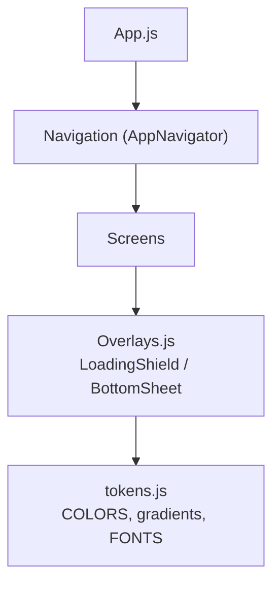
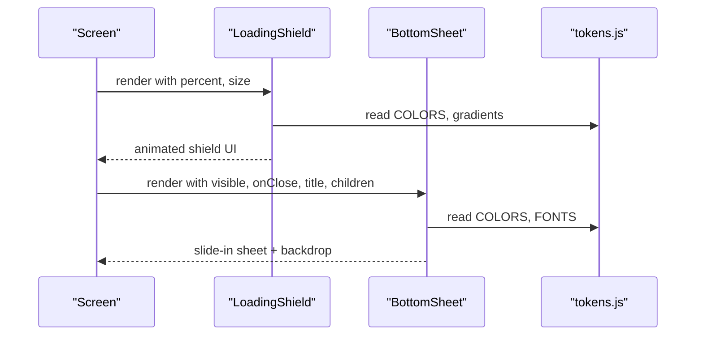
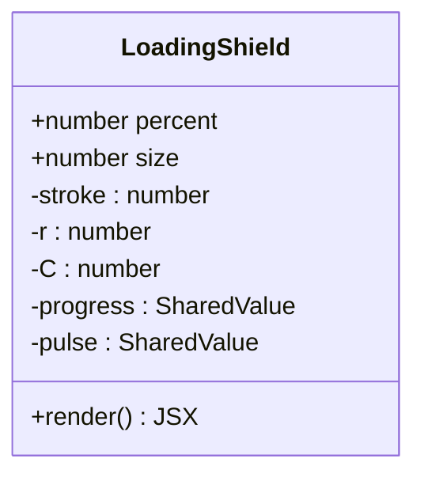
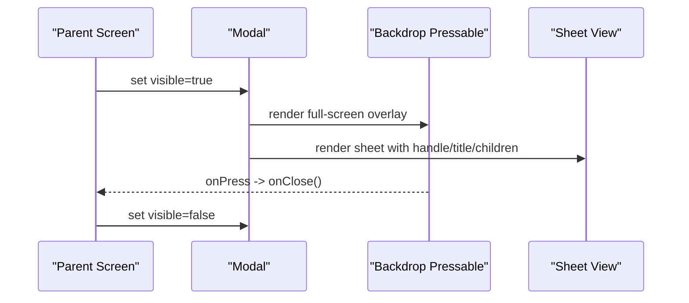
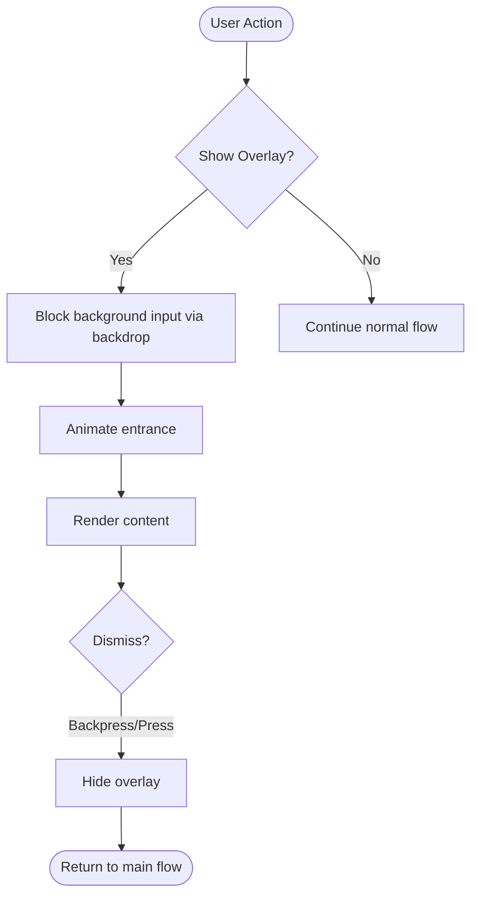
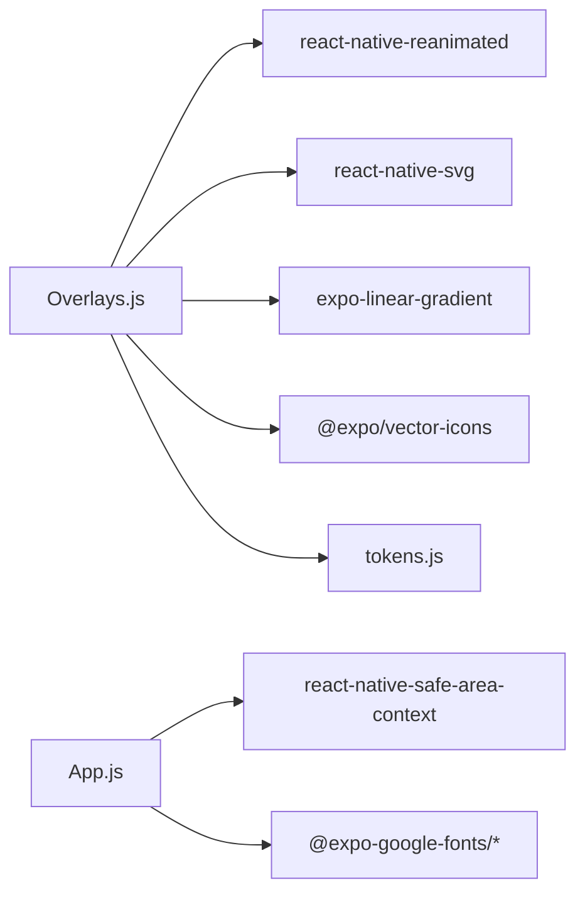

# Overlay Components

<cite>
**Referenced Files in This Document**
- [Overlays.js](file://src/components/Overlays.js)
- [tokens.js](file://src/theme/tokens.js)
- [App.js](file://App.js)
- [README.md](file://README.md)
</cite>

## Table of Contents
1. Introduction
2. Project Structure
3. Core Components
4. Architecture Overview
5. Detailed Component Analysis
6. Dependency Analysis
7. Performance Considerations
8. Troubleshooting Guide
9. Conclusion
10. Appendices

## Introduction
This document explains the overlay components implemented in the project: LoadingShield for animated loading states and BottomSheet for modal interactions. It covers animation effects, backdrop handling, user interaction blocking, positioning, gesture handling, content management, transitions, accessibility, keyboard navigation, touch patterns, and best practices to prevent layout shifts and maintain responsiveness while overlays are active.

## Project Structure
The overlay components live under src/components and consume design tokens from src/theme. The app entry point sets up SafeAreaProvider and fonts before rendering navigation.

**Diagram sources**
- [App.js:21-42](file://App.js#L21-L42)
- [Overlays.js:1-15](file://src/components/Overlays.js#L1-L15)
- [tokens.js:7-68](file://src/theme/tokens.js#L7-L68)

**Section sources**
- [App.js:21-42](file://App.js#L21-L42)
- [Overlays.js:1-15](file://src/components/Overlays.js#L1-L15)
- [tokens.js:7-68](file://src/theme/tokens.js#L7-L68)

## Core Components
- LoadingShield: Animated shield with a rotating progress ring and pulsing glow used during analysis or long-running tasks.
- BottomSheet: A slide-in modal sheet anchored at the bottom with a translucent backdrop that closes on press.

Key props and behavior:
- LoadingShield(percent, size): animates a circular progress indicator and a subtle pulse effect around the central icon.
- BottomSheet(visible, onClose, title, children): renders a full-width sheet with optional title and handle; backdrop dismisses via onPress.

Usage references:
- The README documents these components and their intended usage scenarios.

**Section sources**
- [Overlays.js:18-94](file://src/components/Overlays.js#L18-L94)
- [README.md:217-222](file://README.md#L217-L222)

## Architecture Overview
The overlays are self-contained React Native components that rely on:
- react-native-reanimated for smooth animations
- react-native-svg for vector graphics
- expo-linear-gradient for gradient fills
- Design tokens for consistent colors, fonts, and gradients

**Diagram sources**
- [Overlays.js:18-94](file://src/components/Overlays.js#L18-L94)
- [tokens.js:7-68](file://src/theme/tokens.js#L7-L68)

## Detailed Component Analysis

### LoadingShield
Responsibilities:
- Display an animated circular progress ring based on percent prop
- Provide a pulsing glow behind the central icon
- Use shared values and Reanimated for performant animations

Animation details:
- Progress ring: uses strokeDashoffset driven by a shared value animated with timing to reflect percent
- Pulse effect: continuously repeats a scale oscillation around the central icon container
- Glow: radial gradient behind the shield using SVG Defs and Stop elements

Props:
- percent: number (default 60) — drives progress ring
- size: number (default 120) — controls overall dimensions

Visual structure:
- Outer glow layer (SVG radial gradient)
- Background circle (track)
- Animated progress circle (foreground)
- Central gradient container with icon

Accessibility considerations:
- As currently implemented, the component does not expose aria-like labels or focusable elements. For better accessibility, consider adding accessible labels and roles when integrating into screens.

Performance notes:
- Animations use Reanimated shared values and animated props for GPU-friendly updates
- SVG is sized to the component’s size to avoid unnecessary scaling

Integration tips:
- Mount this component during API calls or analysis phases
- Update percent as your process progresses to reflect real-time feedback

**Section sources**
- [Overlays.js:18-80](file://src/components/Overlays.js#L18-L80)
- [tokens.js:7-68](file://src/theme/tokens.js#L7-L68)

#### LoadingShield Class Diagram

**Diagram sources**
- [Overlays.js:18-80](file://src/components/Overlays.js#L18-L80)

### BottomSheet
Responsibilities:
- Present a modal sheet anchored at the bottom
- Provide a translucent backdrop that closes the sheet on press
- Support optional title and arbitrary children content

Behavior:
- Uses Modal with transparent background and slide animation
- Backdrop occupies full screen and forwards press to onClose
- Sheet has rounded top corners, padding, and a small handle for visual affordance

Props:
- visible: boolean — controls visibility
- onClose: function — called on backdrop press
- title: string? — optional header text
- children: node — content area inside the sheet

Accessibility considerations:
- Currently no explicit accessibility attributes are set on the sheet or handle. When integrating, ensure focus management and announcements are handled by the parent screen if needed.

Gesture handling:
- Backdrop press closes the sheet
- No swipe-to-dismiss is implemented in this version

Transition animations:
- Modal animationType="slide" provides a native slide transition

Integration tips:
- Control visibility via state in the parent screen
- Use onRequestClose to support system back gestures where applicable

**Section sources**
- [Overlays.js:82-94](file://src/components/Overlays.js#L82-L94)
- [tokens.js:7-68](file://src/theme/tokens.js#L7-L68)

#### BottomSheet Sequence Diagram

**Diagram sources**
- [Overlays.js:82-94](file://src/components/Overlays.js#L82-L94)

### Conceptual Overview
Conceptually, overlays provide non-blocking feedback and focused interactions:
- LoadingShield communicates ongoing work without stealing focus
- BottomSheet presents contextual actions or information with a clear dismissal path

[No sources needed since this diagram shows conceptual workflow, not actual code structure]

## Dependency Analysis
- Overlays depend on:
  - react-native-reanimated for animations
  - react-native-svg for vector graphics
  - expo-linear-gradient for gradients
  - @expo/vector-icons for icons
  - Design tokens for colors, fonts, and gradients

- App setup:
  - App.js initializes fonts and wraps navigation in SafeAreaProvider

**Diagram sources**
- [Overlays.js:5-15](file://src/components/Overlays.js#L5-L15)
- [App.js:5-18](file://App.js#L5-L18)
- [tokens.js:7-68](file://src/theme/tokens.js#L7-L68)

**Section sources**
- [Overlays.js:5-15](file://src/components/Overlays.js#L5-L15)
- [App.js:5-18](file://App.js#L5-L18)
- [tokens.js:7-68](file://src/theme/tokens.js#L7-L68)

## Performance Considerations
- Prefer shared values and animated props for smooth 60fps animations (already used in LoadingShield)
- Avoid heavy re-renders by keeping overlay state minimal and controlled by parent screens
- Keep BottomSheet content concise; defer heavy computations until after the sheet opens
- Use appropriate sizes for LoadingShield to minimize SVG redraw costs

[No sources needed since this section provides general guidance]

## Troubleshooting Guide
Common issues and resolutions:
- Modal backdrop not closing: Ensure onClose is passed and invoked; verify visible state toggles correctly in the parent
- Animation jank: Confirm Reanimated is configured properly and avoid synchronous heavy work in animation callbacks
- Layout shifts: Ensure overlays mount/unmount cleanly; avoid animating layout-changing properties on large trees
- Accessibility gaps: Add accessible labels and roles in parent screens when focusing or announcing overlay state changes

**Section sources**
- [Overlays.js:82-94](file://src/components/Overlays.js#L82-L94)
- [README.md:217-222](file://README.md#L217-L222)

## Conclusion
LoadingShield and BottomSheet provide a cohesive overlay experience with smooth animations and clear interaction patterns. LoadingShield offers visual feedback during long-running operations, while BottomSheet delivers focused, dismissible panels for actions or additional information. By following the integration guidelines and accessibility recommendations, you can deliver responsive, user-friendly overlays that enhance the app’s usability.

[No sources needed since this section summarizes without analyzing specific files]

## Appendices

### Implementation Examples

- Loading state during API calls
  - Mount LoadingShield with percent updated as the request progresses
  - Hide the overlay once the response arrives or fails

- Confirmation dialogs
  - Use BottomSheet with a title and action buttons in children
  - Close on backdrop press or explicit button press

- Additional information panels
  - Render descriptive content in BottomSheet children
  - Optionally include a handle and title for context

Guidelines:
- Prevent layout shifts: keep overlay containers fixed-size and avoid animating layout properties
- Maintain responsiveness: offload heavy work to workers or background tasks; animate only lightweight properties
- Keyboard navigation: ensure focus moves logically when overlays appear/disappear; add accessible labels and roles in parent screens
- Touch interactions: provide clear tap targets and obvious dismissal paths (backdrop, close buttons)

**Section sources**
- [Overlays.js:18-94](file://src/components/Overlays.js#L18-L94)
- [README.md:217-222](file://README.md#L217-L222)