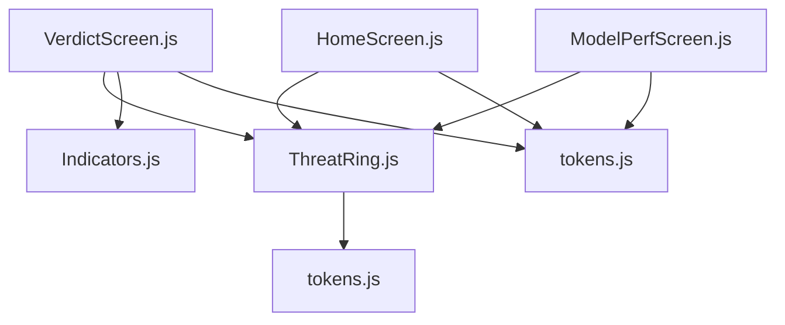
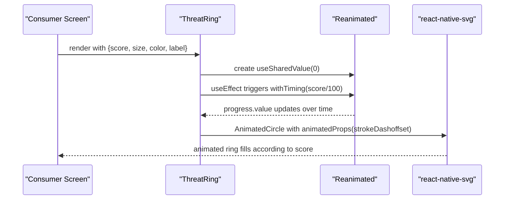
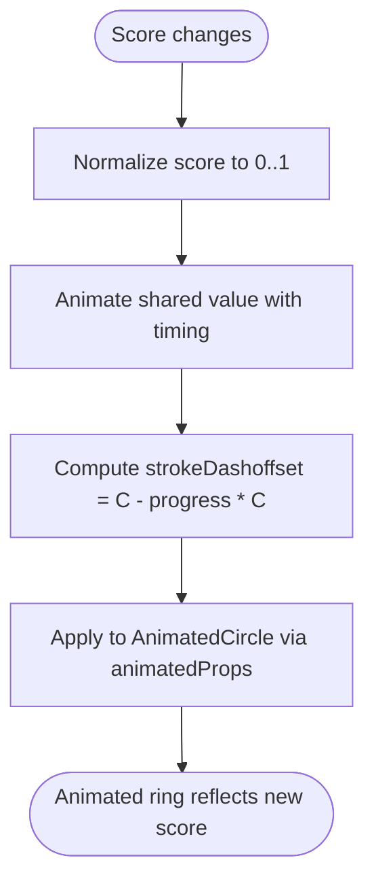
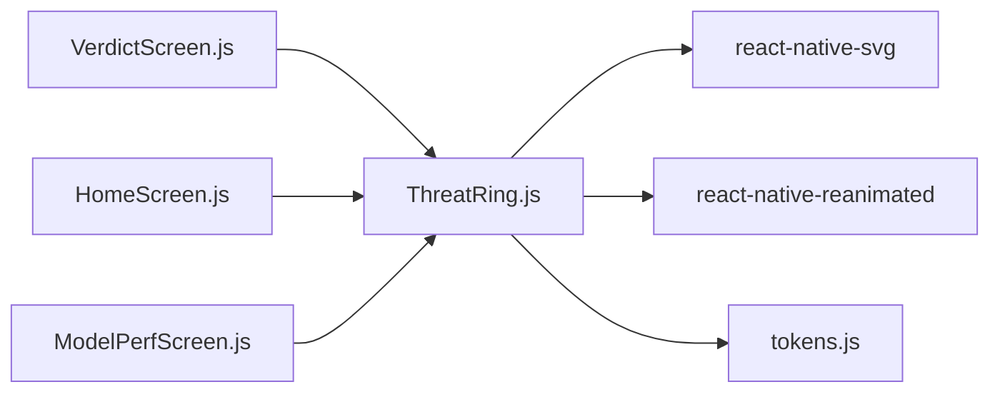

# ThreatRing Component

<cite>
**Referenced Files in This Document**
- [ThreatRing.js](file://src/components/ThreatRing.js)
- [VerdictScreen.js](file://src/screens/VerdictScreen.js)
- [HomeScreen.js](file://src/screens/HomeScreen.js)
- [ModelPerfScreen.js](file://src/screens/ModelPerfScreen.js)
- [tokens.js](file://src/theme/tokens.js)
- [README.md](file://README.md)
</cite>

## Table of Contents
1. [Introduction](#introduction)
2. [Project Structure](#project-structure)
3. [Core Components](#core-components)
4. [Architecture Overview](#architecture-overview)
5. [Detailed Component Analysis](#detailed-component-analysis)
6. [Dependency Analysis](#dependency-analysis)
7. [Performance Considerations](#performance-considerations)
8. [Troubleshooting Guide](#troubleshooting-guide)
9. [Conclusion](#conclusion)
10. [Appendices](#appendices)

## Introduction
The ThreatRing component is an animated SVG circular progress indicator used to visualize threat scores, safety ratings, and confidence levels within the application. It leverages react-native-svg for rendering circles and react-native-reanimated for smooth, performant animations. The component accepts a score from 0 to 100, a size, a color, and an optional label, and animates the ring fill using strokeDashoffset driven by a shared value.

It is integrated across multiple screens to communicate risk and protection status at a glance:
- Verdict screen shows threat or low-risk outcomes with a high-contrast ring.
- Home screen displays a protection score in the hero card.
- Model performance screen visualizes accuracy as a ring metric.

## Project Structure
ThreatRing lives under components and is consumed by several screens. Theme tokens provide colors and typography used by the component and its consumers.

**Diagram sources**
- [ThreatRing.js:1-92](file://src/components/ThreatRing.js#L1-L92)
- [VerdictScreen.js:1-268](file://src/screens/VerdictScreen.js#L1-L268)
- [HomeScreen.js:1-158](file://src/screens/HomeScreen.js#L1-L158)
- [ModelPerfScreen.js:1-170](file://src/screens/ModelPerfScreen.js#L1-L170)
- [tokens.js:1-129](file://src/theme/tokens.js#L1-L129)

**Section sources**
- [ThreatRing.js:1-92](file://src/components/ThreatRing.js#L1-L92)
- [tokens.js:1-129](file://src/theme/tokens.js#L1-L129)

## Core Components
- ThreatRing: Animated SVG ring that maps a 0–100 score to a circular progress arc. Uses Reanimated’s shared values and animated props to animate strokeDashoffset smoothly.
- Consumers:
  - VerdictScreen: Displays verdict-specific rings (threat vs safe) with contrasting colors and labels.
  - HomeScreen: Shows a protection score in the hero area.
  - ModelPerfScreen: Visualizes model accuracy as a ring metric.

Key behaviors:
- Animation duration and easing are fixed inside the component.
- Stroke width scales proportionally with size.
- Center text uses tabular numerals to avoid digit jitter during animation.

**Section sources**
- [ThreatRing.js:18-83](file://src/components/ThreatRing.js#L18-L83)
- [VerdictScreen.js:64-67](file://src/screens/VerdictScreen.js#L64-L67)
- [HomeScreen.js:81](file://src/screens/HomeScreen.js#L81)
- [ModelPerfScreen.js:66](file://src/screens/ModelPerfScreen.js#L66)

## Architecture Overview
ThreatRing encapsulates all animation logic and renders an SVG circle with an animated stroke. Consumers pass numeric scores and styling props; the component computes geometry and drives the animation via Reanimated.

**Diagram sources**
- [ThreatRing.js:24-38](file://src/components/ThreatRing.js#L24-L38)
- [ThreatRing.js:52-63](file://src/components/ThreatRing.js#L52-L63)

## Detailed Component Analysis

### Props and Defaults
- score: number, default 96. Represents a 0–100 value mapped to ring progress.
- size: number, default 140. Controls overall ring dimensions and stroke thickness.
- color: string, default COLORS.danger. Stroke color for the animated ring.
- label: string | undefined. Optional label displayed below the score.

Usage patterns observed:
- High contrast white ring on dark gradients in VerdictScreen.
- Accent green ring in HomeScreen hero card.
- Accuracy ring in ModelPerfScreen with accent color.

**Section sources**
- [ThreatRing.js:18-23](file://src/components/ThreatRing.js#L18-L23)
- [VerdictScreen.js:64-67](file://src/screens/VerdictScreen.js#L64-L67)
- [HomeScreen.js:81](file://src/screens/HomeScreen.js#L81)
- [ModelPerfScreen.js:66](file://src/screens/ModelPerfScreen.js#L66)

### Geometry and Stroke Calculation
- Stroke width is derived from size to maintain visual balance.
- Radius is computed from size and stroke.
- Circumference is calculated to set strokeDasharray and drive strokeDashoffset.

This ensures the ring scales cleanly across sizes while keeping proportions consistent.

**Section sources**
- [ThreatRing.js:24-27](file://src/components/ThreatRing.js#L24-L27)

### Animation Technique: strokeDashoffset
- A shared value tracks progress from 0 to score/100.
- On score change, withTiming animates the shared value with a fixed duration and easing curve.
- Animated props compute strokeDashoffset as circumference minus progress times circumference, causing the visible stroke to grow from zero to full based on the score.

**Diagram sources**
- [ThreatRing.js:29-38](file://src/components/ThreatRing.js#L29-L38)

**Section sources**
- [ThreatRing.js:29-38](file://src/components/ThreatRing.js#L29-L38)

### Shared Value Management and Timing
- useSharedValue initializes a mutable value for the animation state.
- useEffect watches score and starts a withTiming animation to update the shared value.
- Duration and easing are hardcoded in the component; they can be adjusted if future requirements demand variable timing.

Observed configuration:
- Duration: 1200ms
- Easing: custom cubic bezier curve

**Section sources**
- [ThreatRing.js:27-34](file://src/components/ThreatRing.js#L27-L34)

### Rendering Details
- Background track circle is rendered with low opacity and border color from theme tokens.
- Animated foreground circle uses provided color, rounded line cap, and rotation to start at the top.
- Center overlay displays the numeric score and optional label with typography from theme tokens.

**Section sources**
- [ThreatRing.js:41-83](file://src/components/ThreatRing.js#L41-L83)

### Integration Examples Across Screens
- VerdictScreen passes dynamic score and confidence from route params, using white ring color for contrast on gradient backgrounds.
- HomeScreen demonstrates a compact ring in a hero card with accent color and a “PROTECTED” label.
- ModelPerfScreen shows an accuracy ring alongside other metrics.

These examples illustrate how to adapt size, color, and label to different contexts while reusing the same component.

**Section sources**
- [VerdictScreen.js:19-24](file://src/screens/VerdictScreen.js#L19-L24)
- [VerdictScreen.js:64-67](file://src/screens/VerdictScreen.js#L64-L67)
- [HomeScreen.js:81](file://src/screens/HomeScreen.js#L81)
- [ModelPerfScreen.js:66](file://src/screens/ModelPerfScreen.js#L66)

## Dependency Analysis
ThreatRing depends on:
- react-native-svg for Circle and Svg elements.
- react-native-reanimated for shared values, animated props, and timing functions.
- Theme tokens for colors and fonts.

Consumers depend on ThreatRing to visualize scores without implementing animation logic themselves.

**Diagram sources**
- [ThreatRing.js:8-14](file://src/components/ThreatRing.js#L8-L14)
- [VerdictScreen.js:14](file://src/screens/VerdictScreen.js#L14)
- [HomeScreen.js:17](file://src/screens/HomeScreen.js#L17)
- [ModelPerfScreen.js:16](file://src/screens/ModelPerfScreen.js#L16)
- [tokens.js:7-68](file://src/theme/tokens.js#L7-L68)

**Section sources**
- [ThreatRing.js:8-14](file://src/components/ThreatRing.js#L8-L14)
- [tokens.js:7-68](file://src/theme/tokens.js#L7-L68)

## Performance Considerations
- Animations run on the UI thread via Reanimated shared values, minimizing layout thrash.
- strokeDashoffset is updated through animatedProps, which avoids expensive style recalculations.
- Tabular numerals prevent digit width shifts during counting, reducing perceived repaints.
- Fixed animation duration keeps frame pacing predictable.

Recommendations:
- Avoid frequent rapid score updates; batch updates when possible to reduce re-animation triggers.
- Keep size reasonable for target devices; very large rings increase SVG path calculations.
- Use appropriate colors for contrast to ensure readability without additional effects.

[No sources needed since this section provides general guidance]

## Troubleshooting Guide
Common issues and resolutions:
- Ring does not animate: Ensure score prop changes trigger a re-render and that Reanimated is properly configured in the app.
- Incorrect fill direction: Confirm the ring is rotated so the stroke starts at the top; the component handles this internally.
- Label not visible: Provide a non-empty label or rely on the default “/ 100” suffix behavior.
- Color contrast: Choose colors that contrast with the background; VerdictScreen uses white on gradients, HomeScreen uses accent green on a blue gradient.

If you need to adjust timing or easing, modify the shared value animation configuration in the component.

**Section sources**
- [ThreatRing.js:29-38](file://src/components/ThreatRing.js#L29-L38)
- [ThreatRing.js:65-80](file://src/components/ThreatRing.js#L65-L80)

## Conclusion
ThreatRing provides a clean, reusable way to visualize scores with smooth animations. Its design separates concerns: consumers supply data and styling, while the component manages geometry and animation. It integrates seamlessly into dashboards, verdict flows, and performance metrics, offering clear visual feedback for threat levels, safety, and confidence.

[No sources needed since this section summarizes without analyzing specific files]

## Appendices

### API Reference
- Props:
  - score: number (default 96). Range 0–100.
  - size: number (default 140). Controls ring diameter and stroke width.
  - color: string (default COLORS.danger). Stroke color.
  - label: string | undefined. Optional label beneath the score.

- Behavior:
  - Animates ring fill from 0 to score using strokeDashoffset.
  - Uses Reanimated shared values and timing with fixed duration and easing.
  - Renders centered numeric score and optional label.

**Section sources**
- [ThreatRing.js:18-23](file://src/components/ThreatRing.js#L18-L23)
- [ThreatRing.js:29-38](file://src/components/ThreatRing.js#L29-L38)
- [ThreatRing.js:65-80](file://src/components/ThreatRing.js#L65-L80)

### Usage Patterns and Examples
- Scam risk score: Pass a high score with a danger color and a descriptive label.
- Safety rating: Pass a low score with a safe/accent color and a positive label.
- Confidence level: Use a neutral or brand color with a concise label like “ACCURACY”.

Observed usage:
- VerdictScreen: Dynamic score and confidence passed from backend results.
- HomeScreen: Compact ring showing protection status.
- ModelPerfScreen: Accuracy visualization.

**Section sources**
- [VerdictScreen.js:19-24](file://src/screens/VerdictScreen.js#L19-L24)
- [VerdictScreen.js:64-67](file://src/screens/VerdictScreen.js#L64-L67)
- [HomeScreen.js:81](file://src/screens/HomeScreen.js#L81)
- [ModelPerfScreen.js:66](file://src/screens/ModelPerfScreen.js#L66)

### Accessibility Notes
- The component displays numeric values and labels that are readable by screen readers.
- For enhanced accessibility, consider adding aria-like semantics in your app layer if needed (e.g., accessible labels around the ring).

[No sources needed since this section provides general guidance]

### Responsive Design Behavior
- Size prop allows scaling the ring to fit various layouts.
- Stroke width scales proportionally with size for consistent visual weight.
- Typography scales relative to size to keep labels legible.

**Section sources**
- [ThreatRing.js:24-27](file://src/components/ThreatRing.js#L24-L27)
- [ThreatRing.js:65-80](file://src/components/ThreatRing.js#L65-L80)