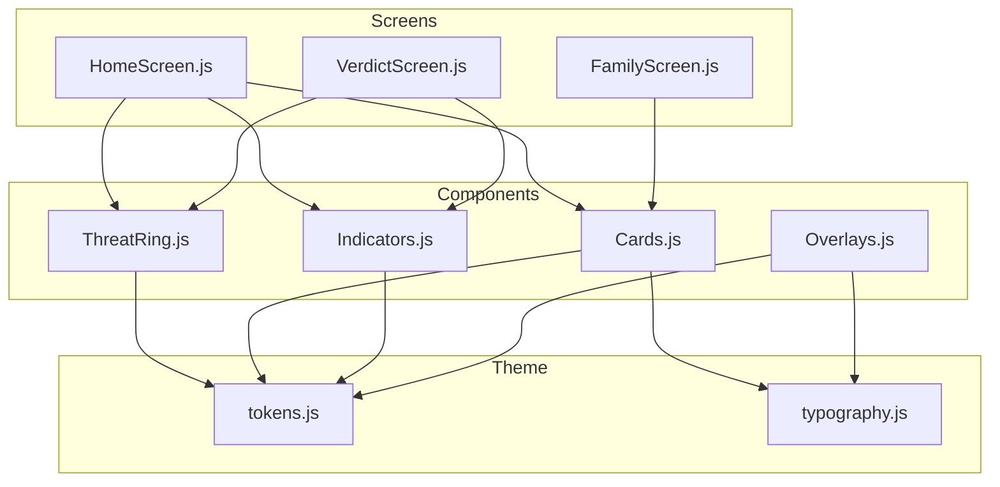
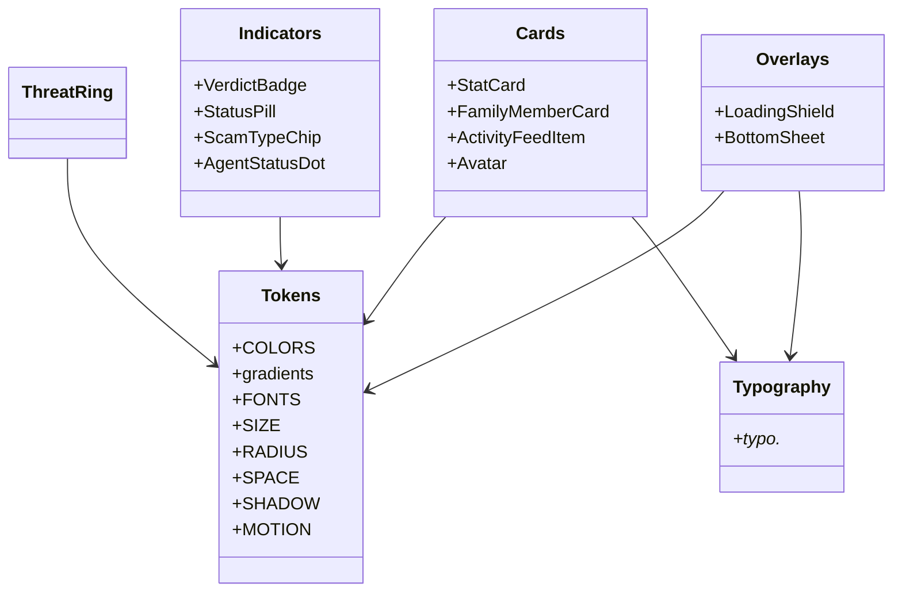
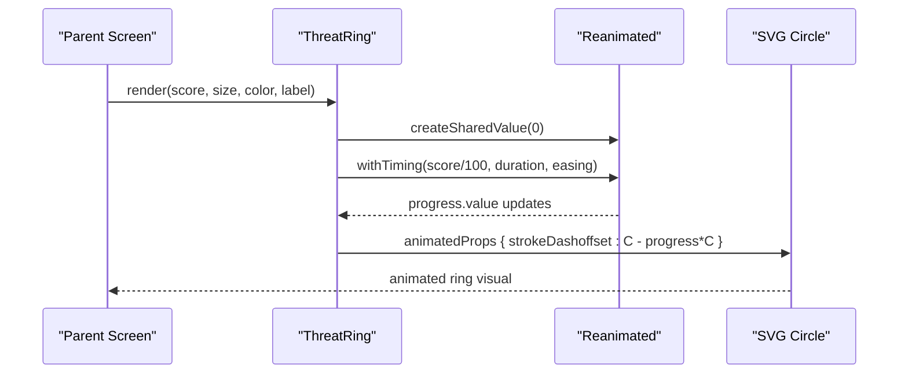
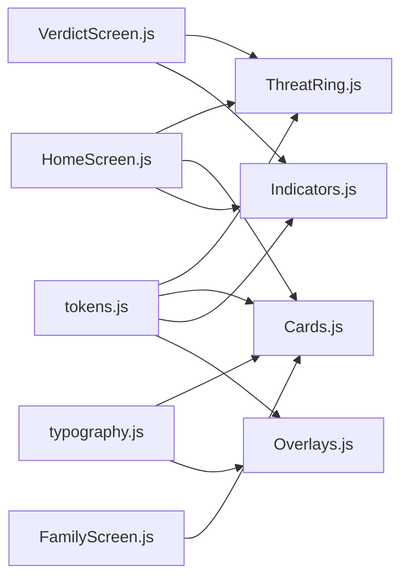

# UI Components

<cite>
**Referenced Files in This Document**
- [ThreatRing.js](file://src/components/ThreatRing.js)
- [Cards.js](file://src/components/Cards.js)
- [Indicators.js](file://src/components/Indicators.js)
- [Overlays.js](file://src/components/Overlays.js)
- [tokens.js](file://src/theme/tokens.js)
- [typography.js](file://src/theme/typography.js)
- [HomeScreen.js](file://src/screens/HomeScreen.js)
- [FamilyScreen.js](file://src/screens/FamilyScreen.js)
- [VerdictScreen.js](file://src/screens/VerdictScreen.js)
- [README.md](file://README.md)
</cite>

## Table of Contents
1. [Introduction](#introduction)
2. [Project Structure](#project-structure)
3. [Core Components](#core-components)
4. [Architecture Overview](#architecture-overview)
5. [Detailed Component Analysis](#detailed-component-analysis)
6. [Dependency Analysis](#dependency-analysis)
7. [Performance Considerations](#performance-considerations)
8. [Troubleshooting Guide](#troubleshooting-guide)
9. [Conclusion](#conclusion)
10. [Appendices](#appendices)

## Introduction
This document provides detailed UI components documentation for Safe Pakistan’s reusable interface elements. It covers animated and static components used across screens, including:
- Animated ThreatRing with SVG circular progress and strokeDashoffset animations
- Card components: StatCard, FamilyMemberCard, ActivityFeedItem, Avatar
- Indicator components: VerdictBadge, StatusPill, ScamTypeChip, AgentStatusDot
- Overlay components: LoadingShield, BottomSheet

For each component, you will find prop specifications, styling options, animation behaviors, accessibility notes, usage examples via code snippet paths, and guidelines for responsive design, theme integration, and composition patterns.

## Project Structure
The UI components live under src/components and are styled using a centralized design system in src/theme. Screens demonstrate how to compose these components into real user flows.

**Diagram sources**
- [ThreatRing.js:1-92](file://src/components/ThreatRing.js#L1-L92)
- [Cards.js:1-193](file://src/components/Cards.js#L1-L193)
- [Indicators.js:1-106](file://src/components/Indicators.js#L1-L106)
- [Overlays.js:1-123](file://src/components/Overlays.js#L1-L123)
- [tokens.js:1-129](file://src/theme/tokens.js#L1-L129)
- [typography.js:1-60](file://src/theme/typography.js#L1-L60)
- [HomeScreen.js:1-158](file://src/screens/HomeScreen.js#L1-L158)
- [FamilyScreen.js:1-101](file://src/screens/FamilyScreen.js#L1-L101)
- [VerdictScreen.js:1-268](file://src/screens/VerdictScreen.js#L1-L268)

**Section sources**
- [README.md:14-42](file://README.md#L14-L42)

## Core Components
This section summarizes the purpose and key props of each component family.

- ThreatRing: Animated SVG ring showing a score (0–100) with smooth fill animation and customizable label/color/size.
- Cards:
  - StatCard: Metric display with icon, value, label, optional Urdu label.
  - FamilyMemberCard: Member row with avatar, role badge, last protected time, and status pill.
  - ActivityFeedItem: Log entry with tone-based color, type/message/time, and verdict badge.
  - Avatar: Initials-based user representation with configurable size and color.
- Indicators:
  - VerdictBadge: Small status pill with icon and label for scam/safe/suspicious.
  - StatusPill: Colored left-border pill for contextual status.
  - ScamTypeChip: Categorization chip with icon and label, tone-driven palette.
  - AgentStatusDot: Real-time status dot with glow when active.
- Overlays:
  - LoadingShield: Animated shield with pulsing scale and rotating progress ring during analysis.
  - BottomSheet: Modal action sheet with backdrop, handle, title, and children content.

**Section sources**
- [ThreatRing.js:1-92](file://src/components/ThreatRing.js#L1-L92)
- [Cards.js:1-193](file://src/components/Cards.js#L1-L193)
- [Indicators.js:1-106](file://src/components/Indicators.js#L1-L106)
- [Overlays.js:1-123](file://src/components/Overlays.js#L1-L123)

## Architecture Overview
The components follow a consistent architecture:
- Theme tokens provide colors, fonts, spacing, radius, shadows, gradients, and motion timings.
- Typography presets standardize text styles across English and Urdu.
- Components are pure presentational units that consume tokens and typography, enabling consistent look-and-feel and easy theming.

**Diagram sources**
- [tokens.js:1-129](file://src/theme/tokens.js#L1-L129)
- [typography.js:1-60](file://src/theme/typography.js#L1-L60)
- [ThreatRing.js:1-92](file://src/components/ThreatRing.js#L1-L92)
- [Cards.js:1-193](file://src/components/Cards.js#L1-L193)
- [Indicators.js:1-106](file://src/components/Indicators.js#L1-L106)
- [Overlays.js:1-123](file://src/components/Overlays.js#L1-L123)

## Detailed Component Analysis

### ThreatRing
Animated SVG circular progress indicator that fills based on a score from 0 to 100. Uses react-native-svg and react-native-reanimated for smooth strokeDashoffset animation.

- Props
  - score: number (default 96). Controls ring fill percentage.
  - size: number (default 140). Outer container size; also influences ring stroke width and typography scaling.
  - color: string (default COLORS.danger). Stroke color for the progress arc.
  - label: string (optional). Displayed below the numeric score.

- Styling
  - Ring background uses border token with low opacity.
  - Progress arc uses provided color with rounded line cap.
  - Center text scales proportionally with size; tabular-nums prevents digit jitter.
  - Label uses muted text color and small font size.

- Animation behavior
  - On mount or score change, the ring animates from empty to filled over ~1200ms with a custom easing curve.
  - Uses shared values and animatedProps to drive strokeDashoffset smoothly.

- Accessibility
  - The numeric score is visible as text; consider adding an accessible label describing the score context in consuming screens.
  - Ensure sufficient contrast between color and background; use brand tokens for consistency.

- Usage examples (code snippet paths)
  - Home hero: [HomeScreen.js:81](file://src/screens/HomeScreen.js#L81)
  - Verdict hero: [VerdictScreen.js:65-67](file://src/screens/VerdictScreen.js#L65-L67)

**Diagram sources**
- [ThreatRing.js:18-38](file://src/components/ThreatRing.js#L18-L38)
- [ThreatRing.js:40-64](file://src/components/ThreatRing.js#L40-L64)

**Section sources**
- [ThreatRing.js:1-92](file://src/components/ThreatRing.js#L1-L92)
- [HomeScreen.js:81](file://src/screens/HomeScreen.js#L81)
- [VerdictScreen.js:65-67](file://src/screens/VerdictScreen.js#L65-L67)

### Cards

#### StatCard
Displays a metric with an icon, value, label, and optional Urdu label.

- Props
  - value: string | number. Primary metric displayed prominently.
  - label: string. English label beneath the value.
  - urduLabel: string (optional). Urdu translation shown below the English label.
  - color: string (default COLORS.primary). Icon background tint.
  - icon: string (default 'shield-checkmark'). Ionicons name.

- Styling
  - Card surface with shadow and border; icon container uses subtle tint of the provided color.
  - Value uses large bold typography; labels use smaller semibold/muted styles.

- Usage examples (code snippet paths)
  - Stats row: [HomeScreen.js:86-88](file://src/screens/HomeScreen.js#L86-L88)

**Section sources**
- [Cards.js:47-59](file://src/components/Cards.js#L47-L59)
- [HomeScreen.js:86-88](file://src/screens/HomeScreen.js#L86-L88)

#### FamilyMemberCard
Represents a family member with avatar, role badge, last protected time, and status pill.

- Props
  - member: object with fields:
    - name: string
    - role: string
    - status: 'safe' | 'off'
    - lastProtected: string
    - color: string (for avatar background)
  - onPress: function. Called when the card is pressed.

- Styling
  - Row layout with avatar, name, role badge, last protected info, and status pill.
  - Pressable with opacity feedback on press.

- Usage examples (code snippet paths)
  - Family list: [FamilyScreen.js:69](file://src/screens/FamilyScreen.js#L69)

**Section sources**
- [Cards.js:61-86](file://src/components/Cards.js#L61-L86)
- [FamilyScreen.js:69](file://src/screens/FamilyScreen.js#L69)

#### ActivityFeedItem
Shows a single activity log entry with tone-based color, type/message/time, and verdict badge.

- Props
  - tone: 'danger' | 'warn' | 'safe'. Determines dot color and badge kind mapping.
  - type: string. Title-like text for the event.
  - message: string. Short description; truncated if too long.
  - time: string. Relative timestamp.

- Styling
  - Left dot color maps to tone; verdict badge maps to kind ('scam', 'susp', 'safe').
  - Soft shadow and bordered card style.

- Usage examples (code snippet paths)
  - Recent activity: [HomeScreen.js:99](file://src/screens/HomeScreen.js#L99)

**Section sources**
- [Cards.js:88-110](file://src/components/Cards.js#L88-L110)
- [HomeScreen.js:99](file://src/screens/HomeScreen.js#L99)

#### Avatar
Initials-based user representation with configurable size and color.

- Props
  - name: string. Used to derive initials.
  - color: string (default COLORS.primary). Background color.
  - size: number (default 44). Width and height; font size scales accordingly.

- Styling
  - Circular container with centered white initials; font size proportional to size.

- Usage examples (code snippet paths)
  - Header avatar: [HomeScreen.js:56](file://src/screens/HomeScreen.js#L56)
  - Family avatars: [FamilyScreen.js:60](file://src/screens/FamilyScreen.js#L60)

**Section sources**
- [Cards.js:12-26](file://src/components/Cards.js#L12-L26)
- [HomeScreen.js:56](file://src/screens/HomeScreen.js#L56)
- [FamilyScreen.js:60](file://src/screens/FamilyScreen.js#L60)

### Indicators

#### VerdictBadge
Small inline status pill with icon and label.

- Props
  - kind: 'scam' | 'safe' | 'susp'. Maps to label, background color, and icon.
  - size: 'md' | 'sm'. Controls padding, icon size, and font size.

- Styling
  - Rounded chip with white icon and label; background color varies by kind.

- Usage examples (code snippet paths)
  - Activity feed: [Cards.js:105](file://src/components/Cards.js#L105)

**Section sources**
- [Indicators.js:10-27](file://src/components/Indicators.js#L10-L27)
- [Cards.js:105](file://src/components/Cards.js#L105)

#### StatusPill
Colored left-border pill for contextual status messaging.

- Props
  - kind: 'safe' | 'danger' | 'warn' | 'info' | 'off'. Controls border color, background, and text color.
  - children: string. Pill text content.

- Styling
  - Left border indicates severity; background and text adapt to kind.

- Usage examples (code snippet paths)
  - Hero protection status: [HomeScreen.js:67](file://src/screens/HomeScreen.js#L67)
  - Family member status: [Cards.js:81-83](file://src/components/Cards.js#L81-L83)

**Section sources**
- [Indicators.js:29-43](file://src/components/Indicators.js#L29-L43)
- [HomeScreen.js:67](file://src/screens/HomeScreen.js#L67)
- [Cards.js:81-83](file://src/components/Cards.js#L81-L83)

#### ScamTypeChip
Categorization chip with icon and label, tone-driven palette.

- Props
  - icon: string (default '⚠'). Chip icon.
  - label: string. Chip text.
  - tone: 'danger' | 'warn' | 'info'. Controls background and text color.

- Styling
  - Rounded chip with contrasting icon and label per tone.

- Usage examples (code snippet paths)
  - Not directly rendered in analyzed screens; available for categorization contexts.

**Section sources**
- [Indicators.js:45-58](file://src/components/Indicators.js#L45-L58)

#### AgentStatusDot
Real-time status indicator with optional glow when active.

- Props
  - label: string. Text next to the dot.
  - status: 'on' | 'busy' | 'off'. Dot color and glow behavior.

- Styling
  - Small dot with label; glow effect when status is 'on'.

- Usage examples (code snippet paths)
  - Agent statuses: [HomeScreen.js:75-78](file://src/screens/HomeScreen.js#L75-L78)

**Section sources**
- [Indicators.js:60-77](file://src/components/Indicators.js#L60-L77)
- [HomeScreen.js:75-78](file://src/screens/HomeScreen.js#L75-L78)

### Overlays

#### LoadingShield
Animated shield with pulsing scale and rotating progress ring during analysis.

- Props
  - percent: number (default 60). Progress percentage for ring fill.
  - size: number (default 120). Container size.

- Styling
  - Radial gradient glow behind the ring.
  - Gradient-filled shield core with shadow.
  - Rotating ring uses strokeDashoffset animation.

- Animation behavior
  - Progress ring animates to percent over ~800ms.
  - Shield core pulses continuously between scale 1.0 and 1.04.

- Usage examples (code snippet paths)
  - Referenced in README as part of analyzing flow; not directly rendered in analyzed screens.

**Section sources**
- [Overlays.js:18-80](file://src/components/Overlays.js#L18-L80)
- [README.md:217-219](file://README.md#L217-L219)

#### BottomSheet
Modal action sheet with backdrop, handle, title, and children content.

- Props
  - visible: boolean. Controls visibility.
  - onClose: function. Called on backdrop press or request close.
  - title: string (optional). Sheet header text.
  - children: ReactNode. Sheet content.

- Styling
  - Full-screen transparent backdrop.
  - Sheet anchored at bottom with rounded top corners, handle bar, and title.

- Usage examples (code snippet paths)
  - Referenced in README for action menus; not directly rendered in analyzed screens.

**Section sources**
- [Overlays.js:82-94](file://src/components/Overlays.js#L82-L94)
- [README.md:221-222](file://README.md#L221-L222)

## Dependency Analysis
Components rely on theme tokens and typography for consistent styling. Some components depend on external libraries like react-native-svg and react-native-reanimated for advanced visuals and animations.

**Diagram sources**
- [tokens.js:1-129](file://src/theme/tokens.js#L1-L129)
- [typography.js:1-60](file://src/theme/typography.js#L1-L60)
- [ThreatRing.js:1-92](file://src/components/ThreatRing.js#L1-L92)
- [Cards.js:1-193](file://src/components/Cards.js#L1-L193)
- [Indicators.js:1-106](file://src/components/Indicators.js#L1-L106)
- [Overlays.js:1-123](file://src/components/Overlays.js#L1-L123)
- [HomeScreen.js:1-158](file://src/screens/HomeScreen.js#L1-L158)
- [FamilyScreen.js:1-101](file://src/screens/FamilyScreen.js#L1-L101)
- [VerdictScreen.js:1-268](file://src/screens/VerdictScreen.js#L1-L268)

**Section sources**
- [README.md:156-165](file://README.md#L156-L165)

## Performance Considerations
- Prefer reanimated shared values and animatedProps for smooth animations; avoid heavy layout recalculations inside loops.
- Use tabular-nums for numeric displays to prevent jitter during animations.
- Keep lists of cards and indicators lightweight; memoize expensive computations if needed.
- Limit the number of concurrent animations on a screen to reduce jank.

[No sources needed since this section provides general guidance]

## Troubleshooting Guide
- If the ThreatRing does not animate, ensure react-native-reanimated plugin is configured and that score changes trigger re-rendering.
- For StatusPill and VerdictBadge, verify that kind values match expected mappings; unexpected kinds may result in undefined styles.
- When integrating BottomSheet, ensure visible state is controlled and onClose is wired to dismiss the modal.
- For RTL and Urdu text, follow typography rules: separate English and Urdu into distinct Text nodes and apply correct writing direction and line heights.

**Section sources**
- [README.md:130-152](file://README.md#L130-L152)
- [Overlays.js:82-94](file://src/components/Overlays.js#L82-L94)
- [Indicators.js:10-43](file://src/components/Indicators.js#L10-L43)

## Conclusion
Safe Pakistan’s UI components form a cohesive, theme-driven system that emphasizes clarity, accessibility, and smooth animations. By leveraging tokens and typography, components remain consistent and easy to extend. Screens demonstrate practical composition patterns for dashboards, family management, and verdict results.

[No sources needed since this section summarizes without analyzing specific files]

## Appendices

### Prop Specifications Summary
- ThreatRing
  - score: number (0–100)
  - size: number
  - color: string
  - label: string (optional)
- StatCard
  - value: string | number
  - label: string
  - urduLabel: string (optional)
  - color: string
  - icon: string
- FamilyMemberCard
  - member: { name, role, status, lastProtected, color }
  - onPress: function
- ActivityFeedItem
  - tone: 'danger' | 'warn' | 'safe'
  - type: string
  - message: string
  - time: string
- Avatar
  - name: string
  - color: string
  - size: number
- VerdictBadge
  - kind: 'scam' | 'safe' | 'susp'
  - size: 'md' | 'sm'
- StatusPill
  - kind: 'safe' | 'danger' | 'warn' | 'info' | 'off'
  - children: string
- ScamTypeChip
  - icon: string
  - label: string
  - tone: 'danger' | 'warn' | 'info'
- AgentStatusDot
  - label: string
  - status: 'on' | 'busy' | 'off'
- LoadingShield
  - percent: number
  - size: number
- BottomSheet
  - visible: boolean
  - onClose: function
  - title: string (optional)
  - children: ReactNode

**Section sources**
- [ThreatRing.js:18-23](file://src/components/ThreatRing.js#L18-L23)
- [Cards.js:13-26](file://src/components/Cards.js#L13-L26)
- [Cards.js:47-59](file://src/components/Cards.js#L47-L59)
- [Cards.js:61-86](file://src/components/Cards.js#L61-L86)
- [Cards.js:88-110](file://src/components/Cards.js#L88-L110)
- [Indicators.js:10-27](file://src/components/Indicators.js#L10-L27)
- [Indicators.js:29-43](file://src/components/Indicators.js#L29-L43)
- [Indicators.js:45-58](file://src/components/Indicators.js#L45-L58)
- [Indicators.js:60-77](file://src/components/Indicators.js#L60-L77)
- [Overlays.js:18-24](file://src/components/Overlays.js#L18-L24)
- [Overlays.js:82-94](file://src/components/Overlays.js#L82-L94)

### Responsive Design Guidelines
- Use relative sizing based on component size props (e.g., ThreatRing scales typography and stroke with size).
- Maintain minimum touch targets (44pt) for interactive elements like chips and buttons.
- Ensure text remains legible across sizes; prefer tokens for spacing and radii.

[No sources needed since this section provides general guidance]

### Theme Integration
- Import tokens for colors, fonts, spacing, radius, shadows, and gradients.
- Use typography presets for consistent English and Urdu text styling.
- Apply shadows consistently using SHADOW tokens to maintain depth hierarchy.

**Section sources**
- [tokens.js:1-129](file://src/theme/tokens.js#L1-L129)
- [typography.js:1-60](file://src/theme/typography.js#L1-L60)

### Component Composition Patterns
- Combine StatCard rows for metrics dashboards.
- Use FamilyMemberCard within scrollable lists for family management.
- Render ActivityFeedItem in vertical stacks for recent activity logs.
- Place ThreatRing in hero sections for threat scoring visualization.
- Use StatusPill and VerdictBadge for inline status communication.
- Wrap actions in BottomSheet for contextual menus.

**Section sources**
- [HomeScreen.js:86-99](file://src/screens/HomeScreen.js#L86-L99)
- [FamilyScreen.js:69](file://src/screens/FamilyScreen.js#L69)
- [VerdictScreen.js:65-67](file://src/screens/VerdictScreen.js#L65-L67)