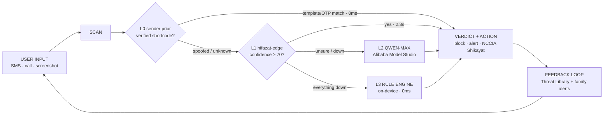

<div align="center">

# HIFAZAT حفاظت — Safe Pakistan

### Three layers. Two models. One shield.

**Pakistan's AI Scam Guardian** — paste any SMS, WhatsApp message, screenshot or
live call and get a clear verdict (SCAM · SUSPICIOUS · SAFE) in 3 seconds,
in English, Roman Urdu and اردو (Nastaliq).

*Apne Ghar Ki Hifazat — Protect Your Home*

<br>


</div>

---

## The problem

Pakistan loses an estimated **$9.3B (≈ Rs 2.6 trillion) a year** to digital
fraud — *Global State of Scams Report 2025*, Global Anti-Scam Alliance &
Feedzai. NCCIA logged **171,600 complaints** in 2024 (**+12.7% YoY**), with
**financial fraud at 47% — the single most-reported cybercrime** — official
statistics from [nccia.gov.pk](https://nccia.gov.pk); growth in reported
online fraud traces NCCIA's briefing to the parliamentary committee via the
Digital Rights Foundation. The fastest-growing victim group is **45+, low
digital literacy, rural, often on zero or slow internet**.

> *"Mubarak ho! Apko 25,000 mile hain. OTP bhejein foran warna account band
> ho jayega."* — to a mother it reads like luck. To hifazat-edge it is a
> textbook OTP scam.

Existing tools fail her three times: **cloud-only** (dies offline),
**English-only** (misses the most targeted users), **one model** (one point
of failure). So we inverted the architecture.

## The 3-layer AI inference cascade



| Layer | Brain | Speed | Cost per scan |
|---|---|---|---|
| **L0** | Sender prior — whitelisted shortcodes + transaction/OTP templates, spoof detection forces escalation | **0ms** | **Rs 0** |
| **L1** | `hifazat-edge` — our fine-tuned Qwen2.5-1.5B, Ollama on-device | **2.3s** | **Rs 0** |
| **L2** | Qwen-Max (Alibaba Cloud Model Studio) — the teacher for unsure cases | ~9s | ≈ Rs 0.85 (quota-shielded) |
| **L3** | On-device weighted rule engine — the unbreakable floor | **0ms** | **Rs 0** |

Confidence gate ≥ 70 · silent escalation · quota shield (cache + daily budget) ·
**every failure path still returns a verdict.** The demo cannot break — it just
changes which brain answers.

## Measured, not promised — 155-message hold-out

`backend/eval-holdout.js` runs 155 UNSEEN messages (95 scam incl. 5
sender-spoofed · 30 suspicious · 30 safe with trigger words like OTP/Rs) through
the live cascade in online **and** offline modes:

| Metric | Cascade (3-run range) | Regex baseline |
|---|---|---|
| Accuracy (online) | **74.8–77.4%** (mean 76.3%) | 46.5% |
| Scam recall (online) | **85.3–88.4%** | 49.5% |
| Safe FPR — legit alerts flagged as scam | **13.3–16.7%** | 16.7% |
| Accuracy (offline, L2 down) | ~59% | 46.5% |

The L3 floor and the eval baseline import the SAME `backend/rules-classifier.js`
— the floor can never drift from what is measured. Spoofed-sender messages are
capped at confidence 50 and force-escalated to L2 — impersonation is an
aggravating signal, never a shortcut.

**Run-to-run variance** (`backend/eval-runs.js`, 3 full online runs):
accuracy 74.8–77.4% (mean 76.3%), scam recall 85.3–88.4%, safe FPR 13.3–16.7%,
macro F1 69.5–71.4%. Any single number is one draw from this range.

## Known limitations — stated plainly

- **L1 JSON parse failure ≈ 55%** on out-of-distribution input (76–80 of ~140
  non-L0 messages per run). Every failure escalates silently to the next layer
  — the user never sees it, but it is why L1 cannot stand alone.
- **Offline safe precision 35–40%**: without the cloud layer the regex floor
  is deliberately conservative and over-flags legit alerts that contain
  trigger words. A cautious wrong-SUSPICIOUS beats a confident wrong-SAFE.
- Run-to-run variance: ±3% accuracy, up to ±7% on safe precision (89.3–95.8% across 3 runs).
- **Suspicious-class recall is weak** — the smallest training slice (336 of
  1,500 examples); v2 needs more ambiguous examples.

## hifazat-edge — our own model

| | |
|---|---|
| Base | Qwen2.5-1.5B-Instruct + **LoRA (Unsloth)** |
| Training data | **1,500 localized examples** — 864 scam / 336 suspicious / 300 safe |
| Training loss | **2.10 → 0.026** |
| Format | Q4_K_M GGUF · CPU inference **2.3s** · **Rs 0/scan** |
| Weights | [huggingface.co/Noman33/hifazat-edge](https://huggingface.co/Noman33/hifazat-edge) |

<div align="center">

<br><sub>Scan for the model card</sub>
</div>

## Why the demo cannot fail

| Failure | What the user sees | Brain that answers |
|---|---|---|
| Fine-tuned model cold / down | Verdict in seconds, no error | L2 Qwen-Max |
| Cloud unreachable (real 503 incident) | Verdict in seconds, no error | L3 rules, 0ms |
| Airplane mode, rural network | Verdict instantly on-device | L3 rules, 0ms |
| Model unsure (conf < 70) | Escalated, never guessed | gate → L2 |

The client races the backend against a 3-second on-device timer — a verdict
always lands instantly; the smartest available answer upgrades it silently.

## Built with Qoder, at AI speed

App (13 screens) + backend cascade + training pipeline were co-built with
**Qoder**, the AI coding agent — in days, not months. Automated verification:
**4/4 cascade harness PASS** plus a documentation-integrity audit.

> *Humans made every product decision. AI executed them at speed.*

## Stack

Expo SDK 54 · React Native 0.81.5 · React 19.1 · Reanimated · react-native-svg ·
React Navigation v6 · Node/Express backend · Ollama local inference ·
Alibaba Cloud Model Studio (Qwen-Max) · EAS Build (APK) · Urdu TTS (ur-PK)

## Demo readiness

- ✓ 4/4 cascade failure scenarios verified by harness
- ✓ Airplane-mode tested — offline verdict floor at 0ms
- ✓ EAS preview APK compiled and on device
- ✓ `/health` pre-stage probe + `DEMO_CHECKLIST.md` stage-day runbook
- ✓ Quota shield active (cache + daily budget)

*We audited ourselves harder than you will.*

## 90-day roadmap

| Phase | Scope |
|---|---|
| **P0** | Supabase auth + scan history (trust infrastructure) |
| **P1** | Family Shield real-time alerts |
| **P2** | Telco / bank white-label integrations |
| **Flywheel** | Every user correction becomes v2 training data |

**Business model:** free forever for vulnerable users. B2B white-label cascade
API for banks & telcos — fraud liability down, support cost down. Edge-first
means near-zero marginal cost per scan (Rs 0 on-device vs ≈ Rs 0.85 cloud).
Users never pay. Institutions do.

---

## Quick start

```bash
yarn install
cp backend/.env.example backend/.env   # add your Qwen key
node backend/index.js                  # cascade on :3000 (warms L1 at boot)
npx expo start                         # app
node backend/verify-cascade.js         # 4-scenario cascade harness
```

<details>
<summary><b>Repository structure</b></summary>

```
├── App.js                     # entry — fonts + navigator
├── backend/
│   ├── index.js               # cascade orchestrator (L0→L1→gate→L2→L3) + /health
│   ├── rules-classifier.js    # L3 floor = eval baseline (one implementation)
│   ├── eval-holdout.js        # 155-message hold-out eval, online + offline
│   ├── eval-runs.js           # 3-run variance harness (run-to-run spread)
│   ├── verify-cascade.js      # automated failure-path harness (4 scenarios)
│   ├── stub-ollama.js         # low-confidence Ollama stub for tests
│   └── .env.example           # credentials template (never commit .env)
├── src/
│   ├── theme/                 # tokens.js + typography.js — single visual source
│   ├── components/            # ThreatRing · Indicators · Cards · Overlays
│   ├── services/              # api.js (3s race) · offlineEngine · LocalDB · Family
│   ├── screens/               # 13 screens incl. LoadingScreen
│   └── navigation/            # stack + 5-tab bar
├── PitchDeck.html             # judge deck (arrow keys to present)
├── SystemDesign.html          # full system design artboards
├── Safe Pakistan.html         # 15-screen design specification canvas
├── DEMO_CHECKLIST.md          # stage-day runbook (hotspot, firewall, /health)
└── SECURITY.md                # secrets policy & pre-push checklist
```

</details>

Design law: one brand blue `#1B4FD8`, red **only** for scam, blue-tinted
shadows, verdict body text ≥ 17pt, 44pt hit targets, WCAG AA contrast.
Languages: exactly three — English · اردو · Roman Urdu.

---

<div align="center">

**Model** · [huggingface.co/Noman33/hifazat-edge](https://huggingface.co/Noman33/hifazat-edge)
&nbsp;·&nbsp; **Deck** · `PitchDeck.html`
&nbsp;·&nbsp; **Security** · `SECURITY.md`

*Three layers. Two models. One shield. Shukriya.*

</div>
