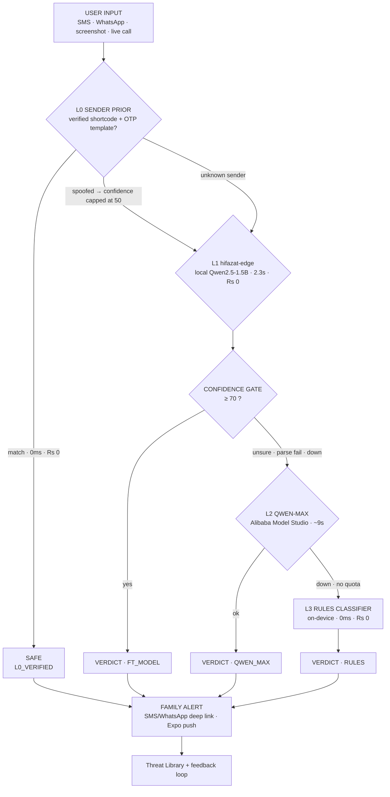

<div align="center">

# HIFAZAT حفاظت — Safe Pakistan

## Pakistan's first offline-first, family-aware AI scam shield

Paste any SMS, WhatsApp message, screenshot or live call and get a clear
verdict — **SCAM · SUSPICIOUS · SAFE** — in 3 seconds, in English, Roman Urdu
and اردو (Nastaliq), plus **one tap to warn your family**.

*Apne Ghar Ki Hifazat — Protect Your Home*

<br>


</div>

---

## At a glance

| | |
|---|---|
| **What it is** | Offline-first scam detector for Pakistan — SMS, calls, screenshots |
| **Verdict speed** | 3 s client race · L1 answers in 2.3 s · L3 floor in 0 ms |
| **Cost per scan** | **Rs 0** on-device · ≈ Rs 0.85 cloud (quota-shielded) |
| **Hold-out accuracy** | **74.8–77.4%** (mean 76.3%) vs 46.5% regex baseline — 155 unseen messages |
| **Resilience** | 4/4 failure-path harness PASS — every outage still returns a verdict |
| **Family-aware** | Real-time alert to guardians: SMS/WhatsApp deep link **or** Expo push |
| **Languages** | English · Roman Urdu · اردو (Nastaliq) — voice read-out in ur-PK |
| **Our model** | [hifazat-edge](https://huggingface.co/Noman33/hifazat-edge) — Qwen2.5-1.5B + LoRA, on Hugging Face |

---

## 2 · The problem

Pakistan loses an estimated **$9.3B (≈ Rs 2.6 trillion) a year** to digital
fraud — *Global State of Scams Report 2025*, Global Anti-Scam Alliance &
Feedzai. NCCIA logged **171,600 complaints** in 2024 (**+12.7% YoY**), with
**financial fraud at 47% — the single most-reported cybercrime** — official
statistics from [nccia.gov.pk](https://nccia.gov.pk); the State Bank of
Pakistan reports digital-fraud complaints up **+62%**. The fastest-growing
victim group is **45+, low digital literacy, rural, often on zero or slow
internet**.

> *"Mubarak ho! Apko 25,000 mile hain. OTP bhejein foran warna account band
> ho jayega."* — to a mother it reads like luck. To hifazat-edge it is a
> textbook OTP scam.

Existing tools fail her three times: **cloud-only** (dies offline),
**English-only** (misses the most targeted users), **one model** (one point of
failure). And even a correct verdict arrives too late if she is the only one
who sees it — the person who can stop her is usually her son, in another city.
So we inverted the architecture **and** made the verdict shareable in one tap.

## 3 · How it works — a cascade that cannot break



| Layer | Brain | Speed | Cost per scan |
|---|---|---|---|
| **L0** | Sender prior — whitelisted shortcodes + transaction/OTP templates; spoof detection forces escalation | **0ms** | **Rs 0** |
| **L1** | `hifazat-edge` — our fine-tuned Qwen2.5-1.5B, Ollama on the laptop/edge | **2.3s** | **Rs 0** |
| **gate** | Confidence ≥ 70 answers; below it, silently escalates — never guesses | — | — |
| **L2** | Qwen-Max (Alibaba Cloud Model Studio) — the teacher for unsure cases | ~9s | ≈ Rs 0.85 (quota-shielded) |
| **L3** | On-device weighted rule engine — the unbreakable floor | **0ms** | **Rs 0** |

Confidence gate ≥ 70 · silent escalation · quota shield (cache + daily budget)
· **every failure path still returns a verdict.** The demo cannot break — it
just changes which brain answers.

### Resilience ladder — what the user sees when things fail

| Failure | What the user sees | Brain that answers |
|---|---|---|
| Fine-tuned model cold / down | Verdict in seconds, no error | L2 Qwen-Max |
| Cloud unreachable (real 503 incident) | Verdict in seconds, no error | L3 rules, 0ms |
| Airplane mode, rural network | Verdict instantly on-device | L3 rules, 0ms |
| Model unsure (conf < 70) | Escalated, never guessed | gate → L2 |
| Push token unavailable (Expo Go / no dev build) | Honest "SMS only" chip — never a fake "sent" | SMS / WhatsApp deep link |

The client races the backend against a 3-second on-device timer — a verdict
always lands instantly; the smartest available answer upgrades it silently.

**Stack:** Expo SDK 54 · React Native 0.81.5 · React 19.1 · Reanimated ·
react-native-svg · React Navigation v6 · Node/Express backend · Ollama local
inference · Alibaba Cloud Model Studio (Qwen-Max) · EAS Build (APK) ·
expo-notifications + Expo push relay · Urdu TTS (ur-PK).

## 4 · WHAT'S NEW — this demo build

Everything below is real, wired code. Nothing is a mock that pretends to be a
network call, and nothing claims a delivery it did not make.

| New | What it actually does |
|---|---|
| **Real-time Family Alert** | Per member, two paths: **PRIMARY** "Send via SMS / WhatsApp" — a zero-backend deep link (`sms:` / `wa.me`) that opens the native app **pre-filled**, with `03XX…` normalized to `923XX…`; **SECONDARY** "Push Alert" — enabled only when that member registered a real Expo push token, relayed by the backend to `exp.host`. On `sent: 0` it toasts *"Push fail hua — SMS use karein"* and keeps SMS highlighted. |
| **Push-ready device enrolment** | On the guardian device: *"Is device ko push-ready banayein"* → notification permission → `getExpoPushTokenAsync()` → `POST /family/register`. If the token call throws (Expo Go, no dev build), the app says so plainly — *"Push is build mein available nahi — SMS alert use karein"* — and marks the member **SMS only**. Push is never faked. |
| **Receiving side** | Foreground → in-app banner with verdict + risk, auto-dismissing. Background → real system notification via Expo/FCM. |
| **Profile settings** | Notification preferences, scan-history auto-delete, and **JSON export** of your own data. |
| **Scoped Guardian chat** | Answers only from verified facts. Out of scope it says *"I don't know"* and routes to **NCCIA 1799** instead of inventing legal advice. |
| **Real analytics** | Charts are driven by actual stored scans — no seeded mock data, and honest empty states on a fresh install. |
| **DEMO · SIMULATED badges** | Any surface still standing in for a production integration is labelled on-screen, so a judge is never misled. |

## 5 · Measured, not promised — 155-message hold-out

`backend/eval-holdout.js` runs 155 UNSEEN messages (95 scam incl. 5
sender-spoofed · 30 suspicious · 30 safe with trigger words like OTP/Rs)
through the live cascade in online **and** offline modes. `backend/eval-runs.js`
repeats it three times; every number below is a **range across those 3 runs**,
not a cherry-picked best.

| Metric | RUN 1 | RUN 2 | RUN 3 | MIN–MAX | MEAN | Regex baseline |
|---|---|---|---|---|---|---|
| Accuracy (online) | 74.8% | 76.8% | 77.4% | **74.8–77.4%** | 76.3% | 46.5% |
| Scam recall | 85.3% | 88.4% | 87.4% | **85.3–88.4%** | 87.0% | 49.5% |
| Safe precision | 95.8% | 92.6% | 89.3% | **89.3–95.8%** | 92.6% | — |
| Safe FPR — legit alerts flagged scam | 16.7% | 13.3% | 13.3% | **13.3–16.7%** | 14.4% | 16.7% |
| Macro F1 | 69.5% | 69.9% | 71.4% | **69.5–71.4%** | 70.3% | — |
| L1 parse fails | 80 | 76 | 78 | **76–80** | 78.0 | — |
| **Accuracy (offline, L2 down)** | — | — | — | **58.7–61.9%** | — | 46.5% |

### Per-layer attribution (representative online run)

| Layer | Predictions | Correct | Accuracy |
|---|---|---|---|
| **L0_VERIFIED** (sender prior) | 22 | 22 | **100.0%** |
| **FT_MODEL** (hifazat-edge) | 52–60 | — | **56–68%** |
| **QWEN_MAX** (cloud teacher) | 73–81 | — | **~76%** |
| **RULES** (regex floor) | 0 online | — | — |

L0 whitelist/template decisions are perfect by construction; L1 is the
fast-and-cheap middle; the cloud layer cleans up its misses. **Offline floor:
58.7–61.9% at Rs 0** — still above the 46.5% baseline with no network at all.

The L3 floor and the eval baseline import the SAME
`backend/rules-classifier.js` — the floor can never drift from what is
measured. Spoofed-sender messages are capped at confidence 50 and
force-escalated to L2: impersonation is an aggravating signal, never a
shortcut.

### We broke our own model on purpose

| | |
|---|---|
| **Run 1** | 30% accuracy, 40% false alarms — **lost to a regex baseline** |
| **Diagnosis** | JSON serialization failure + no sender verification |
| **Fix** | L0 sender prior (never a bypass) + OTP delivery branch + shared rules classifier as the offline floor |
| **Run 2** | **76.3% mean accuracy · 87% scam recall · FPR 14.4%** — baseline 46.5% |
| **Offline** | 58.7–61.9% — still above baseline, at Rs 0 |

> Most teams show a loss curve. We show a stress test.

## 6 · Honesty Doctrine

*We audited ourselves harder than you will.* These limitations are stated
plainly, in the README, the model card and the app itself:

- **L1 JSON parse failure ≈ 55%** on out-of-distribution input (76–80 of ~140
  non-L0 messages per run). Every failure escalates silently to the next layer
  — the user never sees it, but it is why L1 cannot stand alone.
- **Offline safe precision 35–40%**: without the cloud layer the regex floor
  is deliberately conservative and over-flags legit alerts that contain
  trigger words. A cautious wrong-SUSPICIOUS beats a confident wrong-SAFE.
- Run-to-run variance: ±3% accuracy, up to ±7% on safe precision (89.3–95.8% across 3 runs).
- **Suspicious-class recall is weak** — the smallest training slice (336 of
  1,500 examples); v2 needs more ambiguous examples.
- Confidence scores are model outputs, not calibrated probabilities.
- **"Offline" means the on-device rules floor (L3) and the local L1 model on
  the laptop** — L1 needs the hotspot; only L3 is truly network-free.
- **Demo-build networking:** `API_BASE` points at the laptop's LAN IP over the
  phone hotspot, which requires cleartext HTTP
  (`expo-build-properties → android.usesCleartextTraffic`). **That flag is
  DEMO-BUILD only — production serves https (Cloud Run) and the flag comes
  out.** Marked in `src/services/api.js` and `app.json`.
- **Cloud Run does not yet serve `/family/*`.** Until the backend is
  redeployed, push enrolment returns `{sent: 0}` and the app falls back to the
  SMS/WhatsApp deep link — which needs no backend at all.
- A false SAFE is more harmful than a false SCAM, so the cascade prefers
  escalation over guessing. Verdicts are not legal advice; reporting goes to
  **NCCIA Shikayat** (helpline **1799**).

## Roadmap & business model

| Phase | Scope |
|---|---|
| **P0** | Supabase auth + scan history (trust infrastructure) |
| **P1** | Family Shield at production scale — Alibaba Cloud Mobile Push + FCM |
| **P2** | Telco / bank white-label integrations |
| **Flywheel** | Every user correction becomes v2 training data |

**Business model:** free forever for vulnerable users. B2B white-label cascade
API for banks & telcos — fraud liability down, support cost down. Edge-first
means near-zero marginal cost per scan (Rs 0 on-device vs ≈ Rs 0.85 cloud).
**Users never pay. Institutions do.**

## 7 · Quickstart

### 7.1 Backend (the cascade)

```bash
cd backend && npm install
cp .env.example .env                 # add your Qwen key — never commit .env

OLLAMA_KEEP_ALIVE=24h ollama serve   # long keep-alive: never evict L1 mid-demo
ollama pull hifazat-edge             # or load the local GGUF as hifazat-edge

node index.js                        # cascade on :3000 (warms L1 at boot)
```

Expect the warm-up scan log line (`scam/99`) before any demo traffic. Cold
first-call latency (~8s) is the main operational risk — warm it, then keep it
warm.

Verify:

```bash
node verify-cascade.js               # 4-scenario failure-path harness → 4/4 PASS
node eval-holdout.js                 # 155-message hold-out, online + offline
node eval-runs.js                    # 3-run variance
```

> **Harness gotcha:** kill leftover backend processes first (`Get-Process node`)
> and pin the model with a `keep_alive: 24h` warm-up call. Stale servers
> contend for Ollama and make scenario 1 escalate to L2 — an environment
> artifact, not a cascade defect.

### 7.2 App

```bash
npm install
npx expo start                       # Expo Go: LAN http works (debug build)
```

`API_BASE` in `src/services/api.js` must be the laptop's LAN IP on the phone's
hotspot — `ipconfig`, then `http://<LAN-IP>:3000` (marked `// DEMO-BUILD`).
Open port 3000 inbound and confirm from the **phone's browser**:
`http://<LAN-IP>:3000/health`.

### 7.3 APK install (both phones)

```bash
npx expo prebuild --platform android --clean   # bakes usesCleartextTraffic into the manifest
eas build --platform android --profile preview # → APK download URL
```

Install the same APK on **both** phones (Chrome → open the URL → install;
allow "unknown sources"). Android 9+ blocks cleartext HTTP in **release**
builds unless that plugin is present — without it the app silently falls back
to the on-device floor and looks like it is working while never reaching the
laptop.

### 7.4 Two-phone family-alert choreography

Both phones on the **same hotspot**, laptop backend running on `:3000`.

| # | Phone B — the *receiver* (family member) | Phone A — the *sender* (guardian) |
|---|---|---|
| 1 | Install APK, fresh launch → **honest empty states**, no mock data | Install APK |
| 2 | Family Shield → **add member**: name, role, **phone number** (required) → saved to device | — |
| 3 | Tap **"Is device ko push-ready banayein"** → allow notifications → token registers → chip reads **"Push linked"**. In Expo Go it honestly reads **"SMS only"** | — |
| 4 | — | Scan → the **"25,000 OTP"** preset → verdict **SCAM, 96 red** |
| 5 | — | **Family Ko Batain** → pick the member → **PRIMARY "Send via SMS / WhatsApp"** → native SMS opens **pre-filled** |
| 6 | — | **SECONDARY "Push Alert"** (live only with a real token) → **"Push sent · real"** |
| 7 | Foreground → **in-app banner** with verdict + risk. Backgrounded → **system notification** | On `sent: 0` → toast *"Push fail hua — SMS use karein"*, SMS stays highlighted |

Airplane-mode repeat of step 4 on Phone A: the verdict must still land
(L3 floor, 0ms) — the "cannot break" moment.

## 8 · Links

<div align="center">

| | |
|---|---|
| **Model card + weights** | [huggingface.co/Noman33/hifazat-edge](https://huggingface.co/Noman33/hifazat-edge) |
| **Product vision** | [`VISION.md`](VISION.md) |
| **Security & secrets policy** | [`SECURITY.md`](SECURITY.md) |
| **Stage-day runbook** | [`DEMO_CHECKLIST.md`](DEMO_CHECKLIST.md) |
| **Model card (repo copy)** | [`MODEL_CARD.md`](MODEL_CARD.md) |
| **Judge deck** | `PitchDeck.html` (arrow keys to present) |


<br><sub>Scan for the model card</sub>

</div>

<details>
<summary><b>Repository structure</b></summary>

```
├── App.js                     # entry — fonts, navigator, family-alert banner
├── backend/
│   ├── index.js               # cascade orchestrator (L0→L1→gate→L2→L3) + /health
│   │                          #   + /family/register, /family/alert (Expo push relay)
│   ├── rules-classifier.js    # L3 floor = eval baseline (one implementation)
│   ├── eval-holdout.js        # 155-message hold-out eval, online + offline
│   ├── eval-runs.js           # 3-run variance harness (run-to-run spread)
│   ├── verify-cascade.js      # automated failure-path harness (4 scenarios)
│   ├── stub-ollama.js         # low-confidence Ollama stub for tests
│   └── .env.example           # credentials template (never commit .env)
├── src/
│   ├── theme/                 # tokens.js + typography.js — single visual source
│   ├── components/            # ThreatRing · Indicators · Cards · Overlays
│   ├── services/              # api.js (3s race) · offlineEngine · LocalDB · Family
│   ├── screens/               # 14 screens incl. LoadingScreen + ProfileScreen
│   └── navigation/            # stack + 5-tab bar
├── app.json                   # DEMO-BUILD: usesCleartextTraffic for LAN http
├── eas.json                   # preview profile → internal APK
├── PitchDeck.html             # judge deck
├── SystemDesign.html          # full system design artboards
├── Safe Pakistan.html         # 15-screen design specification canvas
├── DEMO_CHECKLIST.md          # stage-day runbook (hotspot, firewall, /health)
├── SECURITY.md                # secrets policy & pre-push checklist
└── VISION.md                  # product vision & sprint plan
```

</details>

Design law: one brand blue `#1B4FD8`, red **only** for scam, blue-tinted
shadows, verdict body text ≥ 17pt, 44pt hit targets, WCAG AA contrast.
Languages: exactly three — English · اردو · Roman Urdu.

---

<div align="center">

**Built with Qoder, at AI speed** — app (14 screens) + backend cascade +
training pipeline co-built in days, not months. Automated verification:
**4/4 cascade harness PASS** plus a documentation-integrity audit.

> *Humans made every product decision. AI executed them at speed.*

*Three layers. Two models. One shield. Shukriya.*

</div>
